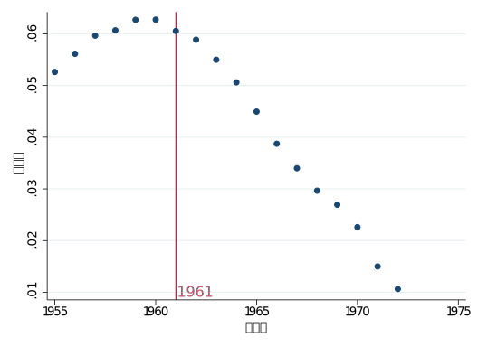
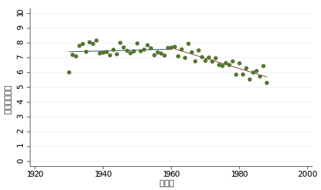
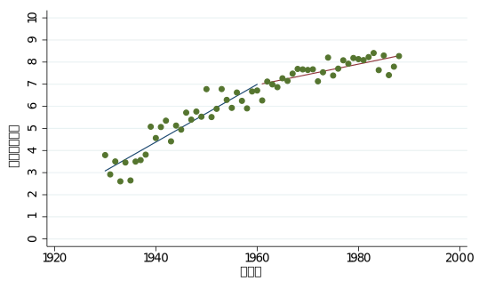

class: left bottom

# 芋仔還是芋仔番薯？
#### 戰後台灣的國語政策與族群通婚

何雨忻，20210730

---

## 大綱

1. 背景
   1. 國語政策的年代差異
   2. 「國語」與文化同化
   3. 美國的德語禁令
2. 資料與估計模型
3. 估計結果
   1. 通婚
   2. 台語／國語能力
   3. 政治傾向
4. 未來工作

---

## 背景

.left-col[
#### 國語政策的年代差異
]

.right-col[
- 國府遷台前（1945 — 49）
    - 魏建功：禁日語，鼓勵方言以興國語
- 來台後漸漸收緊打壓方言（包括台語、客家話）
    - 1950s：〈加強國語教育辦法〉針對教師的發音
    - 1960s：
        - 校園開始出現針對台灣方言的處罰措施
        - 開辦國語文競賽
        - 師範學校禁說日語、方言，要求標準國語發音
    - 1970s：國民黨強化語言治理
        - 方言傳播空間收緊：《雲州大儒俠》被迫停播
        - 頒訂〈國語推行辦法〉
- **為什麼 70 年代出現政策轉向？**
    - 1971 退出聯合國，國民黨政權面臨外交挫敗
]

---

## 背景

.left-col[
#### 國語政策的年代差異
#### 「國語」與文化同化
]

.right-col[
- 「國語」：北京官話 + 各省投票 = 官方標準發音
    - 實際上幾乎沒有人真的在講這種「標準語」
- 漢語語系龐大，外省人的母語不完全是「國語」
	> 「我的世界，由父親、母親、赤腳的玩伴組成。當他們動感情的時候 ── 生氣、傷心、痛快的時候──**父親出口說湖南話，母親說浙江話，玩伴們說閩南話**。當他們冷靜的時候──討論、讀書、客套寒暄、**言不由衷的時候──他們就說國語**。」（龍應台，1997）
- 國語政策：讓外省人、本省人一起說一套原本都不屬於他們的語言（）
]

---

## 背景

.left-col[
#### 國語政策的年代差異
#### 「國語」與文化同化
#### 美國的德語禁令
]

.right-col[
[Fouka, V. (2020). Backlash: The Unintended Effects of Language Prohibition in U.S. Schools after World War I. **REStud**](https://doi.org/10.1093/restud/rdz024)

- 德語禁令的後果：
  - 自願參軍率下降
  - 傾向內婚而非通婚
  - 傾向取德文名字
- 語言的統一究竟是促進族群間的同化，還是讓族群內部感到存亡危機而建構更強烈的自我認同？
]

---

## 資料來源

- 1980、1990 戶口普查人口檔
  - 婚姻狀況
  - 省籍分佈
- 1990、1991、1992、2007 社會變遷調查
  - 語言能力、政治傾向變數

---

## 估計模型

$$
Y = \alpha + \left( \beta \operatorname{exposure} + \gamma \operatorname{exposure} \times \operatorname{MLTR} \right) + \delta \operatorname{MLR} + \zeta \operatorname{lnpop} + \left( i\_{city} + i\_{age} + i\_{gender} + i\_{ethnic} + i\_{year} \right) + \epsilon
$$

- Outcomes
	- 通婚、國語／台語能力、國族認同、支持獨立、政黨傾向
- Treatment
	- $\mathrm{exposure} = (\mathrm{birthyear} - 1961)/6 \in [0, 1]$​​​
	- $\mathrm{MLTR}$​（Mainlander Teacher Ratio）：  
	外省籍老師佔全部老師的比例（包含所有教育階段）
	  - 藉此去 proxy 政策的落實強度
- Controls
	- $\mathrm{MLR}$​（Mainlander Ratio）：鄉鎮市區的外省人口佔比
	- $\mathrm{lnpop}$​​：鄉鎮市區人口數取對數
- Fixed-effects:
	- $i\_{city}$ 縣市；   $i\_{age}$ 年齡； $i\_{gender}$​ 性別； $i\_{ethnic}$ 族群（本省／外省）； $i\_{year}$ 問卷年份；

---

layout: true

## 估計結果

---

.left-col[
#### 跨省籍通婚
]

.right-col[
資料：1990 人口普查（$\mathrm{intermarriage}$​​）、1980 人口普查（外省老師比例）

疑似有 age effect，年輕時就結婚的人比較不通婚、傾向內婚
]

---

.left-col[
#### 跨省籍通婚
]

.right-col[
#### 迴歸結果

.regtable[
|                                          | (1) intermarriage | (2) intermarriage |
| ---------------------------------------- | ----------------- | ----------------- |
|                                          |                   |                   |
| $\mathrm{exposure}$​​                      | 0.0519***         | 0.0279***         |
|                                          | (0.00229)         | (0.00254)         |
|                                          |                   |                   |
| $\mathrm{exposure} \times \mathrm{MLTR}$ |                   | 0.0699***         |
|                                          |                   | (0.00293)         |
|                                          |                   |                   |
| DepVar Mean                              | 0.0784            | 0.0778            |
| Obs.                                     | 3049485           | 2927973           |
| Adj. R-Square                            | 0.102             | 0.103             |
]
]

---

.left-col[
#### 跨省籍通婚
#### 台語／國語能力
]

.right-col[
資料：1992、2007 社會變遷調查（地區為十五歲前常住地區）

]

---

.left-col[
#### 跨省籍通婚
#### 台語／國語能力
]

.right-col[

台語被壓抑，但國語也沒比較好
]

---

.left-col[
#### 跨省籍通婚
#### 台語／國語能力
]

.right-col[
#### 迴歸結果

.regtable[
|                                          | (1) 台語能力 | (2) 台語能力 | (3) 國語能力 | (4) 國語能力 |
| ---------------------------------------- | ------------ | ------------ | ------------ | ------------ |
|                                          |              |              |              |              |
| $\mathrm{exposure}$                      | -0.2         | 0.0592       | 1.521**      | 1.762**      |
|                                          | (0.445)      | (0.494)      | (0.513)      | (0.557)      |
|                                          |              |              |              |              |
| $\mathrm{exposure} \times \mathrm{MLTR}$ |              | -0.948       |              | -0.901       |
|                                          |              | (0.864)      |              | (0.874)      |
|                                          |              |              |              |              |
| DepVar Mean                              | 7.956        | 7.957        | 7.169        | 7.168        |
| Obs.                                     | 1289         | 1285         | 1289         | 1285         |
| Adj. R-Square                            | 0.159        | 0.159        | 0.181        | 0.181        |
]
]

---

#### 國族認同、支持獨立、政黨傾向

資料：1990、1991 社會變遷調查（地區為現住地）

.regtable[
|                                          | (1) 台灣人認同 | (2) 台灣人認同 | (3) 支持獨立 | (4) 支持獨立 | (5) 傾向國民黨 | (6) 傾向國民黨 |
| ---------------------------------------- | -------------- | -------------- | ------------ | ------------ | -------------- | -------------- |
|                                          |                |                |              |              |                |                |
| $\mathrm{exposure}$                      | -0.108         | -0.108         | -0.113       | -0.101       | 0.108          | 0.11           |
|                                          | (0.166)        | (0.168)        | (0.142)      | (0.142)      | (0.252)        | (0.255)        |
|                                          |                |                |              |              |                |                |
| $\mathrm{exposure} \times \mathrm{MLTR}$ |                | 0.00166        |              | -0.0514      |                | -0.00692       |
|                                          |                | (0.132)        |              | (0.0990)     |                | (0.175)        |
|                                          |                |                |              |              |                |                |
| DepVar Mean                              | 0.108          | 0.108          | 0.0772       | 0.0772       | 0.307          | 0.307          |
| Obs.                                     | 1573           | 1573           | 1501         | 1501         | 1732           | 1732           |
| Adj. R-Square                            | 0.0377         | 0.037          | 0.0227       | 0.0221       | 0.0181         | 0.0176         |
]

---

layout: false

## 未來工作

- Fouka (2020)
	- 志願役、從警、公務員
	- 但在台灣的脈絡下，這些職業選擇可能和家庭收入、生涯期望更有關係
- 台語、國語能力
	- 1961 年有一個轉折（kink）

