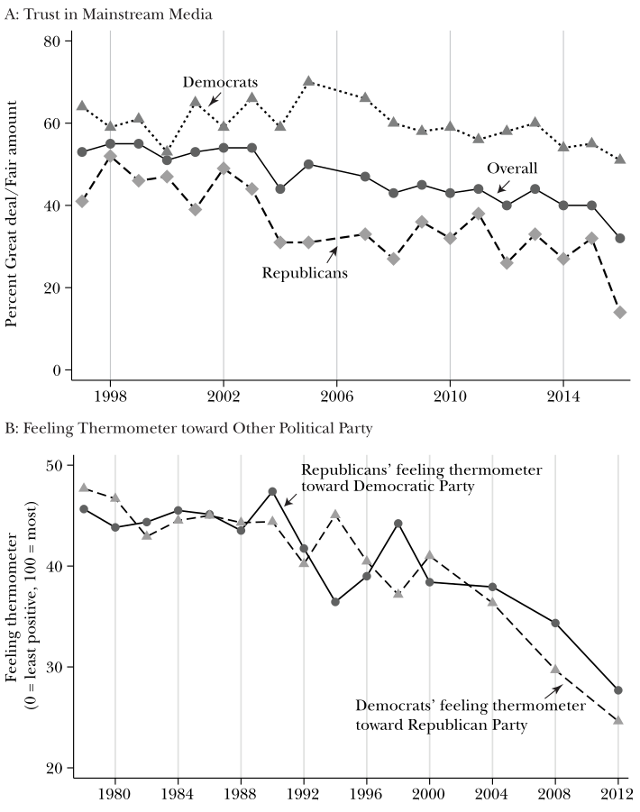
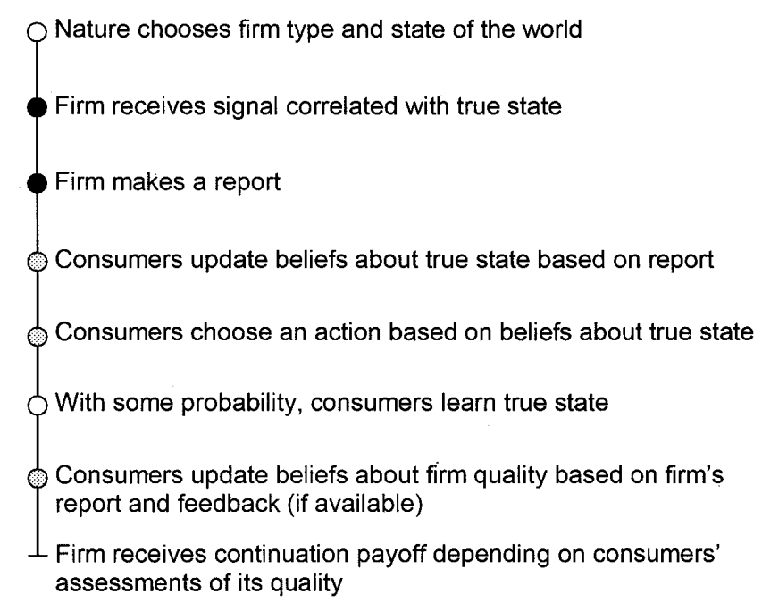
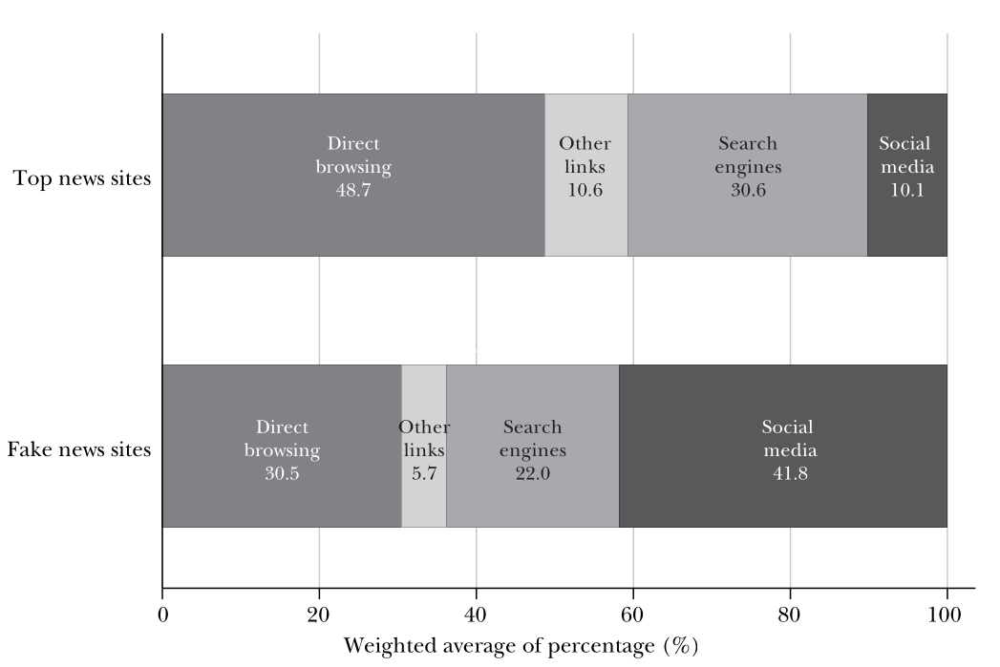
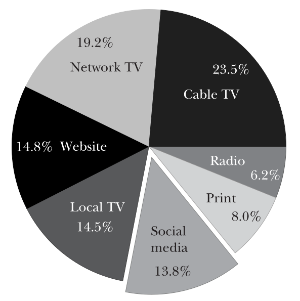
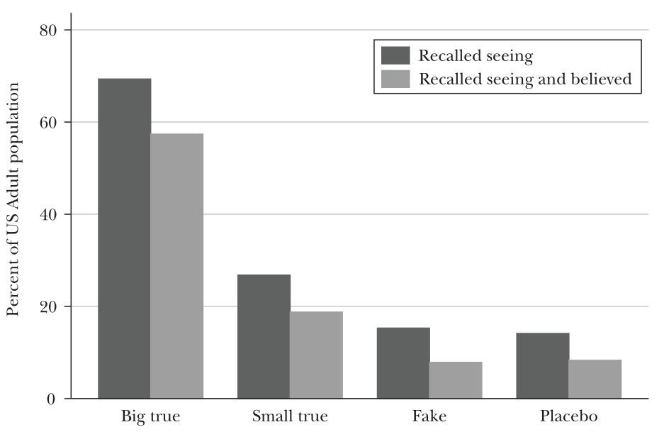
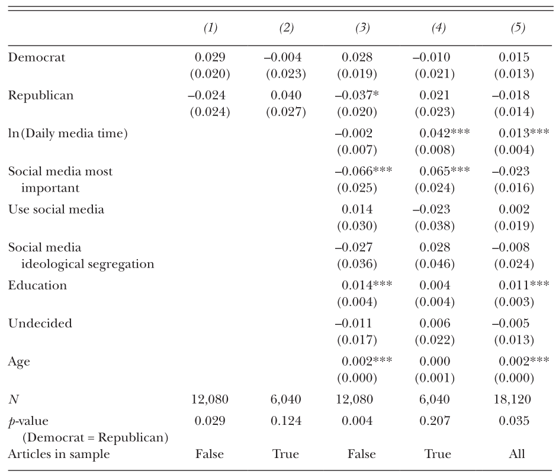
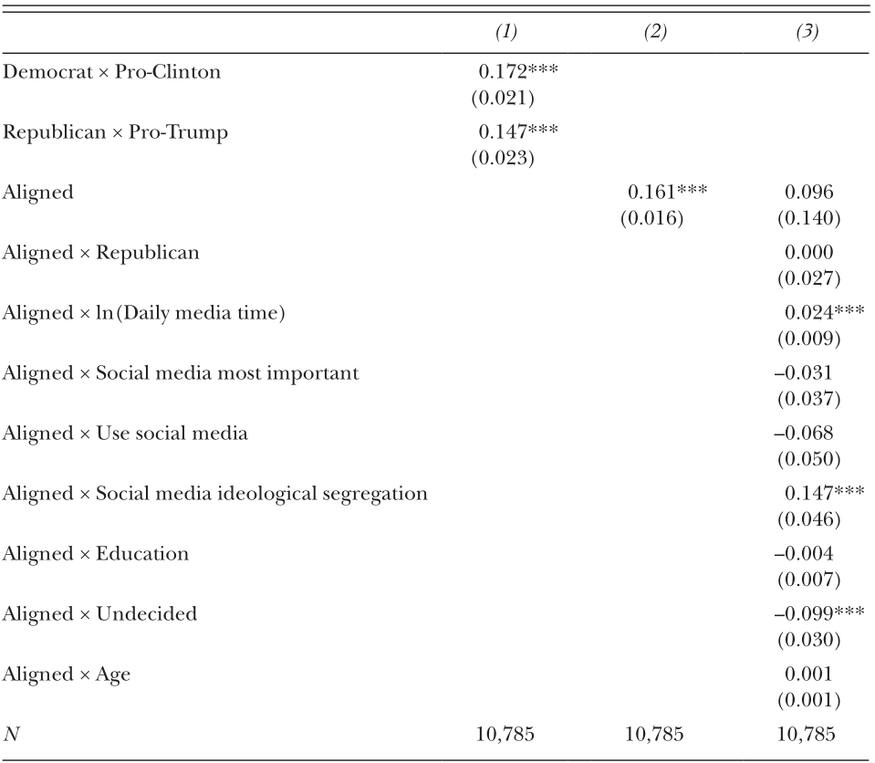

# Motivation

Why Social Media? Why Fake News?

- 62% adult American use social media to consume news
- Fake news are mostly circulated through social media
- Social media had lowered the entry barrier of news market, potentially brought more low quality sources into the market.
- Most popular fake news inclined to favor Donald Trump, which might affect the result of 2016 presidential election.

---

{width=60%}

---

## Definition of Fake News

News articles that are **intentionally** and **verifiably false**, and could mislead readers.

Not including: conspiracy theories that aren’t falsifiable.

# A Model of News Market

{width=80%}

## Supply Side

1. There are 2 **unobserved** state of the world: Clinton or Trump will perform better in office.
2. Firms obtained signals correlated with true state through journalism.
3. Each firms owned a **report strategy** that mapped the signal into their publication:
	Report truthfully or biased.

## Demand Side

1. Consumers have their own (heterogeneous) prior beliefs on the true state of the world.
2. Consumers’ utility come from (1) learning truth, and (2) confirming their prior beliefs.
	1. Specifically, they must “vote the right person”
	2. **Trade-off**: legitimate news v.s. false news but which made them happy

## Feedback

- Consumers update their belief on quality of media firms through their posterior observation on the true state of the world.
	- E.g. Observing the performance of Donald Trump while he’s in office.
- Consumers choose whether to consume in future periods.
- Media firms have incentives to enlarge their audience base due to advertising revenue.

## Incentives to Produce Fake News

1. Feedback is limited/expensive, rational consumers tends to judge fake news outlet to be higher quality, inflecting future consumption.
2. Fake news that confirms prior beliefs might increase consumers’ utility.

Model implication: Fake news is like media bias, which is mostly induced by consumer’s preference.

## Implications on Fake News

Characteristics of fake news producers:

1. No investment in journalism. (zero correlation between their signal and true state)
2. Do not attempt to build long-term reputation.

Reasons why consumers would buy it:

1. Hard to observe the true state
2. News confirming beliefs increase private utility

---

### Externalities and Welfare Loss

1. Inaccurate signals decrease the private utility provided by knowing the truth.
2. False beliefs might undermine democratic process.
3. Consumers might be more skeptical towards legitimate news.
4. Fake news reduce the incentive of high-quality media to invest in journalism.

# Real Data on Fake News

- Fake news headlines: gathered from fact check websites/columns
	- Snopes.com: 138 articles
	- PolitiFact.com: 13 articles
	- BuzzFeed: 21 articles
- Facebook share data: BuzzSumo
- Website traffic data: Alexa

---

---

### Partisanship

Among 156 fake news articles:

- 41 pro-Clinton, 115 pro-Trump
- 7.6 million and 30.3 million times shared respectively

# Exposure to Fake News

## Post-Election Survey

- November 28, 2016 (3 weeks after election)
- Sample: 1208 US adults
- Online questionaire
- Questions
	- How much time spent on election news, and by how much through social media?
	- What’s your most important news source?
- 15 headlines selected randomly out of 30
	- Have you seen this headline?
	- Do you think it’s true? 
	- Some were placebo headlines to detect false recall.
- Reweighted to fit nationwide demographic characteristics

---

{width=70%}

---

{width=70%}

\center{Fake - Placebo = 1.2\%}

---

### Imputing Exposure of Fake News

- Average share per article = 0.386 million
- Recalled seeing = 1.2%
- Chance of recalled exposure = 1.2% / 0.386 = 3% (per million shares)
- 3% $\times$ 38 million (Total shares) =  1.14 (per adult)

# Who Believes Fake News

## Who’s Outperforming in Distinguishing Fake News?

$$
C_{i a} = \alpha_{1} \mathbf{X}_{i}+\alpha_{0}+\varepsilon_{i a}
$$

for respondent $i$, headline $a$.

Outcome $C_{i a} = 1$ if correctly identify the truthfulness of headline, 0.5 if respondent is not sure, 0 otherwise.

Dependent variable $\mathbf{X}_i$ is a vector of individual characteristics

---

{width=75%}

## Ideological Alignment and Belief of News Headlines

$$
B_{i a}=\beta_{D} D_{i} C_{a}+\beta_{R} R_{i} T_{a}+\gamma_{D} D_{i}+\gamma_{R} R_{i}+\varepsilon_{i a}
$$

for respondent $i$, headline $a$

$B_{i a}$ = 1 for believing the article is real, 0.5 if not sure, 0 if no.

$D_i$ for self-reported Democrat, $C_a$ for pro-Clinton headline.

$R_i$ for self-reported Republican, $T_a$ for pro-Trump headline.

Headlines are assigned randomly and equally with true/false, pro-Clinton/pro-Trump.

- $\beta$ captures the aligned ideology effect
- $\gamma$ captures partisanship effect

---

{width=70%}

*Differences between Democrats and Republicans in the magnitude of ideologically aligned inference are not statistically significant.*

# Contribution

> We do not provide an assessment of this claim (fake news pivoting election result) one way or another.

- An descriptive overview of fake news exposure during 2016 U.S. presidential election.
- Media literacy, instead of partisanship, better explains the ability to distinguish fake news.
- Both Democrats and Republicans tends to believe in the ideologically-aligned news.

