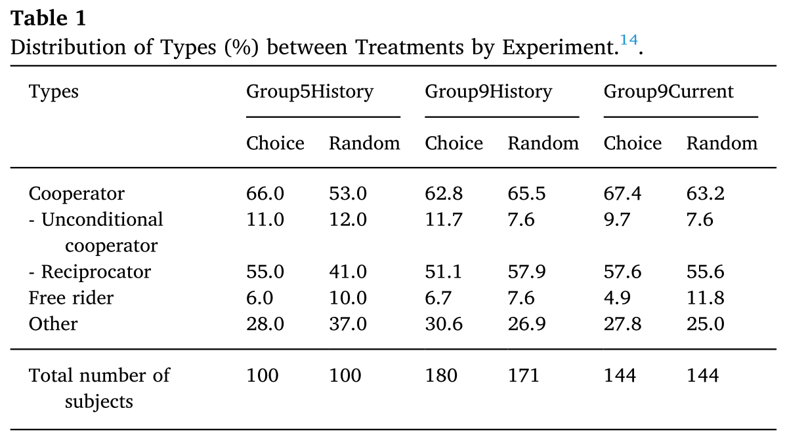
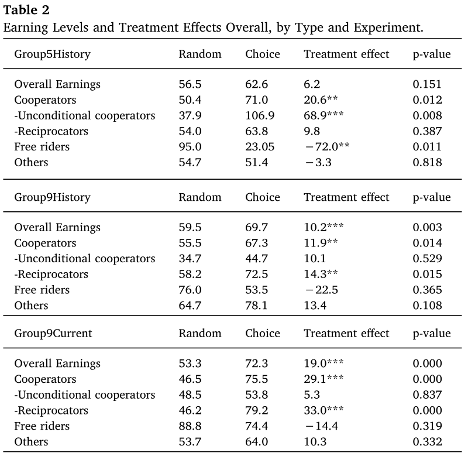
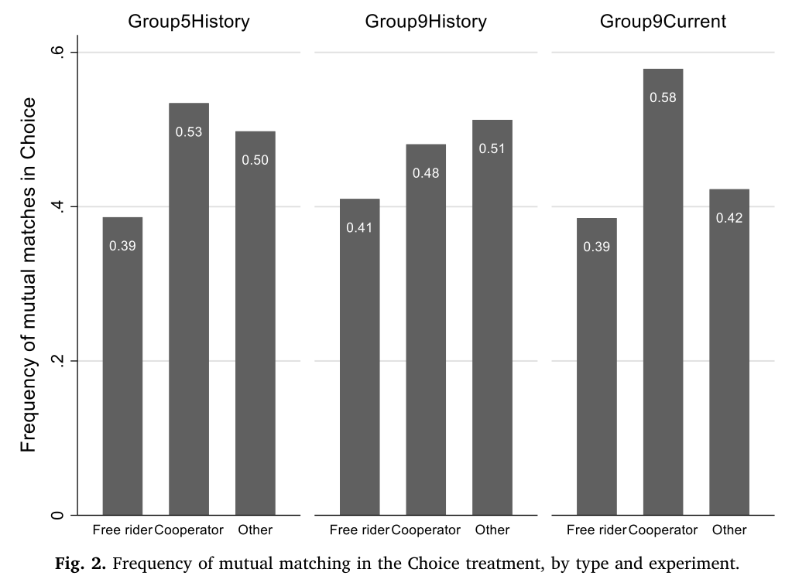
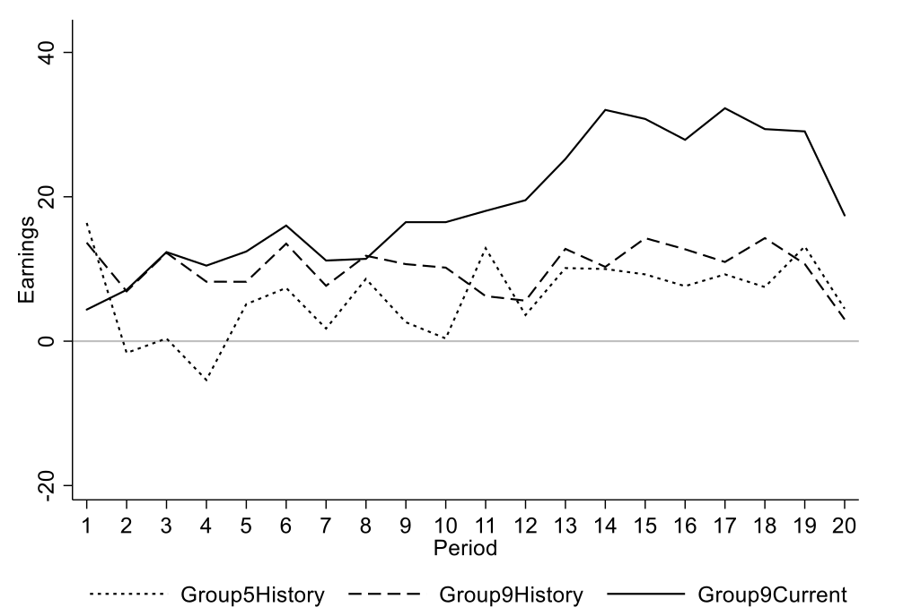
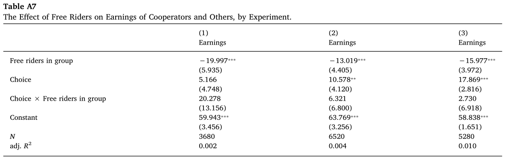

# Introduction

*“Does it pay to be a nice guy?”*

Under repeated prisoner’s dilemma game:

1.   Cooperators outperform freeriders when **mutual partner choice is allowed**.
2.   Subjects living in **larger societies** have extra incentives to develop a good reputation.
3.   Providing **reputational history** before choosing partner doesn’t improve earning.

# Experimental Design

## Step 1

To elicit personal cooperative types: cooperator, or free rider.

- One-shot sequential prisoner’s dilemma game
- Given first-mover’s contribution to public good $y^k$, individuals $i$ as second-mover choose $y^k_i$

Estimate Linear Contribution Profile (LCP) for each individual $i$,:
$$
y^k_i = \alpha_i + \beta_i y^k + u^k_i, k=0,1,2,\dots 10
$$
where $\alpha_i$ = unconditional contribution; $\beta_i$ = conditional contribution.

---

Then we have $\hat{y}^k_i$, the predicted contribution profile.

### Types of individuals

$$
\begin{array}{rl}
	\text{Free rider, } &\hat y_i^k < 2.5 \\
	\text{Unconditional cooperator, } &\hat y_i^k \geq 7.5 \\
	\text{Reciprocator, } &-2.5 + k \leq \hat y_i^k \leq 2.5+k \\
	&\text{ for } k = 0, 1, 2, \dots 10
\end{array}
$$

## Step 2

Authors conducted 3 experiments seperately:

|  Group5History   |  Group9History   |    Group9Current    |
| :--------------: | :--------------: | :-----------------: |
|   N=5 (Small)    |   N=9 (Large)    |     N=9 (Large)     |
| Full Information | Full Information | Current Information |

- Each with 2 treatment: Choice v.s. Random

20 periods, repeated, simultaneous prisoner’s dilemma game

-   Odd participants: 1 subject always excluded
-   Earning function: $\pi_i = 10 - x_i + 0.7(x_i + x_j)$
-   10 = endowment, individual $i$ choose its contribution $x_i$

---

{width=90%}

# Results

## The Benefits of Being a Cooperator

{width=80%}

---

### Assortativity

1.2%, 11.3%, and 22% higher in Choice treatment.

### Successful Mutual Matching Frequency

{width=70%}

## Group Size and Reminder of Personal Reputation History

{width=60%}

\normalsize Why complete information leads to lower earning? *Search cost creates incentives for cooperation.*

# Discussion

### Choice improved cooperators’ earning even with more freeriders

---

### Free riders tends to be the one being excluded

\include{free-riders-exclusion.tex}

---

### Free riders do not fake itself as cooperators

\include{free-riders-fake.tex}

# Remarks

1.   Partner choice is good for cooperators, bad for free riders.
2.   Cooperators have higher probability of matching a cooperator, and less being excluded from the game.
3.   Partner choice effect is greater at “large” society (although not significant)
4.   Altruism might be an evolutionarily stable strategy (ESS) in competitive partnering market.
