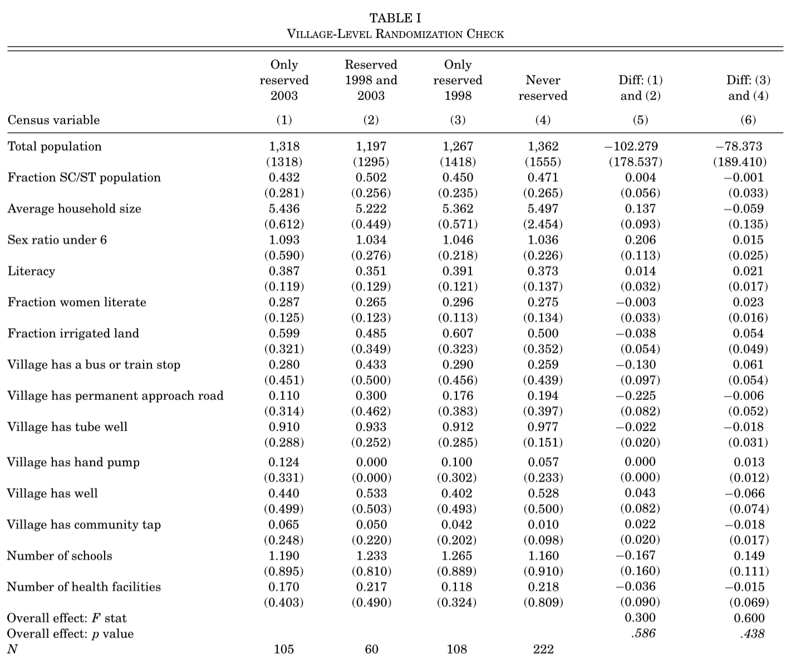
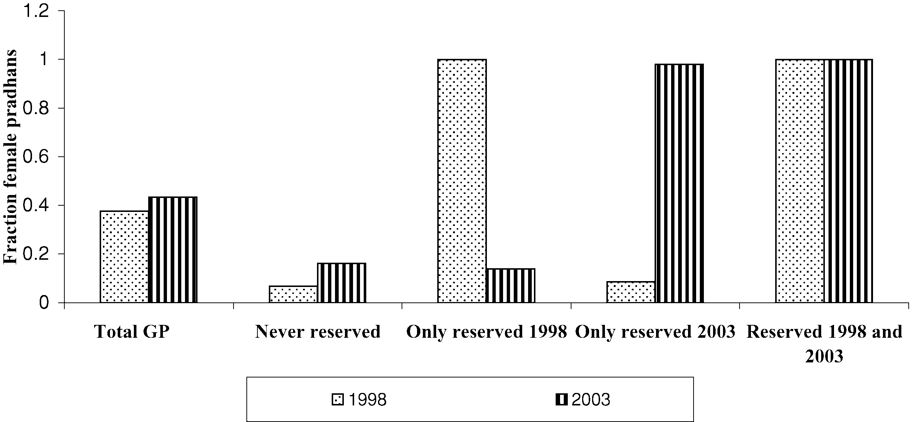
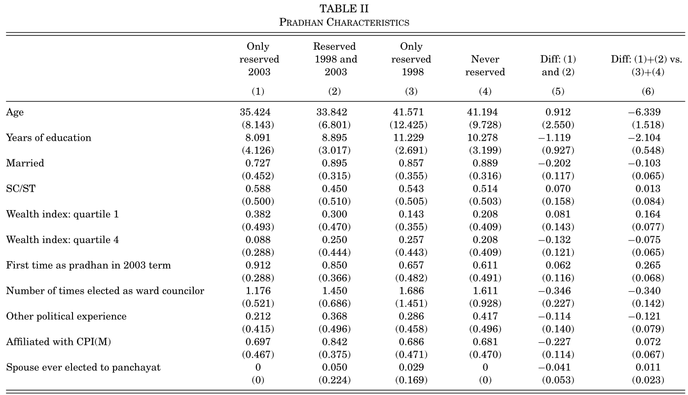
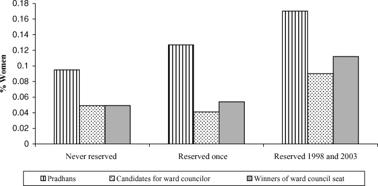
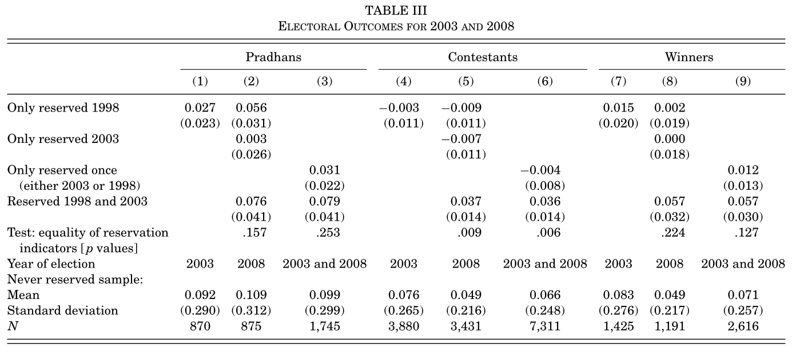
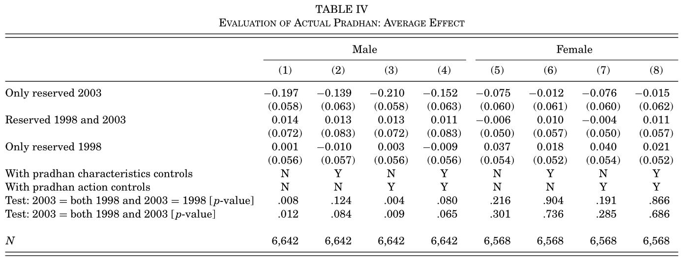
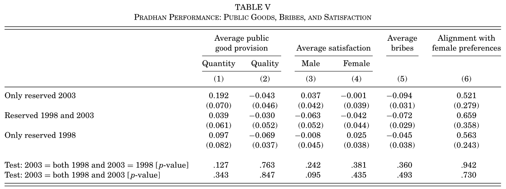
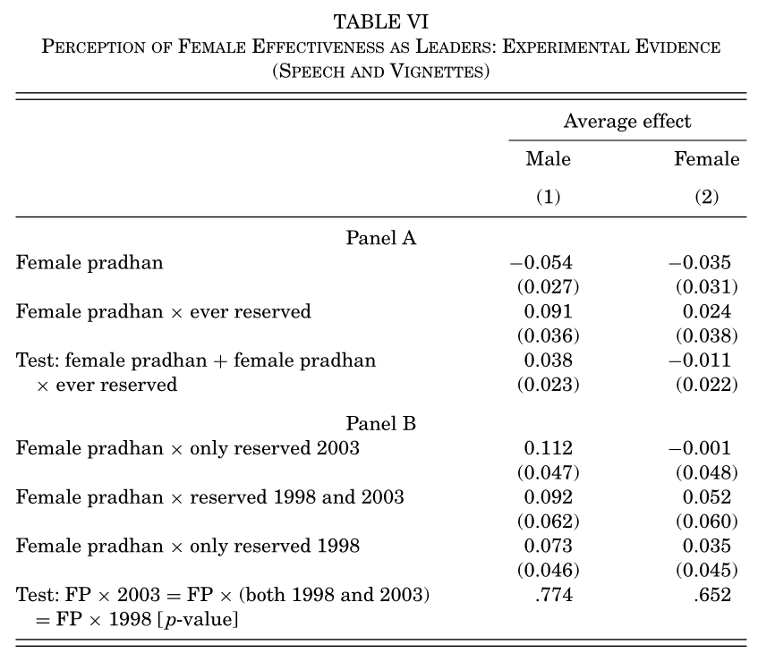
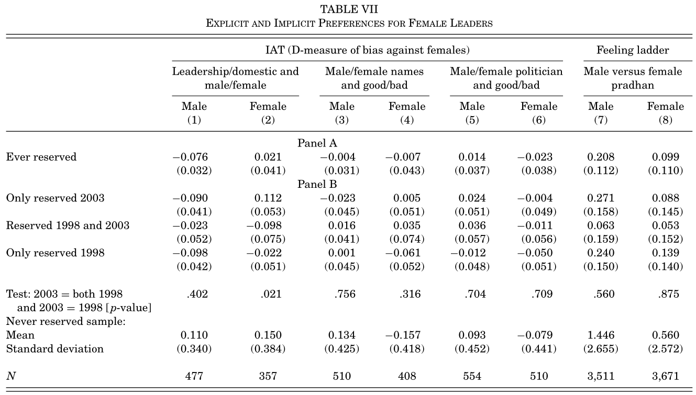

# Highlights

- This paper utilized random treatment of chief councilor reservation in India.
- Electoral prospect for women improved.
- Male’s evaluation on female chief’s effectiveness decreased in the short-run, but improved after 2 reservation.
- Some stereotypes against women persisted.

# Introduction

General discussion around gender quota policy:

1. **Empathy**: exposure improves understanding
2. **Information Provision**: updating prior belief to reduce statistical discrimination
3. **Backlash**: “reverse discrimination”, threatened status for privileged group

## Identification: Female Quota in Indian Local Councils

*Panchayat*: District > Block > **Village** (*Gram Panchayats, GP*)

- 1993 Constitutional Amendment
  - 1/3 councilor seats reserved for female
  - 1/3 GPs’ chief councilor (*Pradhan*) reserved for female, chosen randomly.

### Related Subsequent Literatures

- Female entrepreneurship \footnotesize (Ghani, Kerr, and O’Connell 2014) \normalsize
- Report of crimes against women \footnotesize (Iyer et al. 2012) \normalsize
- Neonatal mortality of female \footnotesize (Kalsi 2017) \normalsize
- Female educational attainment \footnotesize (Beaman et al. 2012) \normalsize

## Sample

- Sample: Villages in West Bengal
  - Active elections long before the amendment.
- Electoral results from 1998, 2003, 2008
- Supplemented by survey and experimental data

---

# Outcome: Electoral Results

## Reservation is Binding

---

## 

No significant incumbent advantage or being “shadows for their husband”

## Improved Female Electoral Prospect

---

# Survey: Evaluation of Pradhan

- Survey: 2006-2007 (in-office pradhan elected in 2003)
- 495 villages, 165 GPs in Birbhum District, West Bengal
- 15 households per village
- Questions
  1. “Is pradhan effective”
  2. “Did pradhan look after village needs”
  3. “Did pradhan look after your needs”
  4. “Did pradhan make BPL^[Below poverty line] lists well”

---

- Worse evaluation for once and near reservation, compared to non-reserved
- Improved evaluation for twice reservation (not significant)
  - Characteristic difference? *No*
  - Behavioral difference?
  - Backlash?

---

## Behavioral Difference for Once v.s. Twice Reserved

- Objective performance (public goods, bribes) and subjective satisfaction was even greater for once reserved
  1. Not taking bribes: public opinion adversely influenced
  2. Aligned preference for women

# Experiments: Stereotypes Against Female

## Experiment (1) Hypothetical Leader Effectiveness

- Respondents were provided tape/vignette for policy speeches given by a pradhan
- Same tape/vignette for each respondent, but substituting protagonist’s gender to elicit implicit bias
- Same questions regarding leader effectiveness

---

- Male’s bias against female leader was updated after reservation
- Female’s belief wasn’t updated: less involved in politics, or counter-stereotypic figure makes them feel uncomfortable

## Experiment (2) Implicit Bias of Gender

- IAT Experiment: Matching two concepts in short time

| Left                   | Right               |
| ---------------------- | ------------------- |
| Male/Female Picture    | Leadership/Domestic |
| Male/Female Name       | Good/Bad            |
| Male/Female Politician | Good/Bad            |

---

# Conclusion

- Gender quota helps improving female’s political representation.
- Gender quota reduced bias in evaluating female’s political effectiveness, but gender role bias persists.

# Linkage to My Proposal

## Contributions

- Taiwanese experience: Better IV consists of time and geographical variation
- Further evidence on affirmative actions, public exposure of powerful women

## Current Findings

- More female politician, less son preference.
  - Supported by both newborn data and survey data.
- Improved female’s gender role self-recognition.