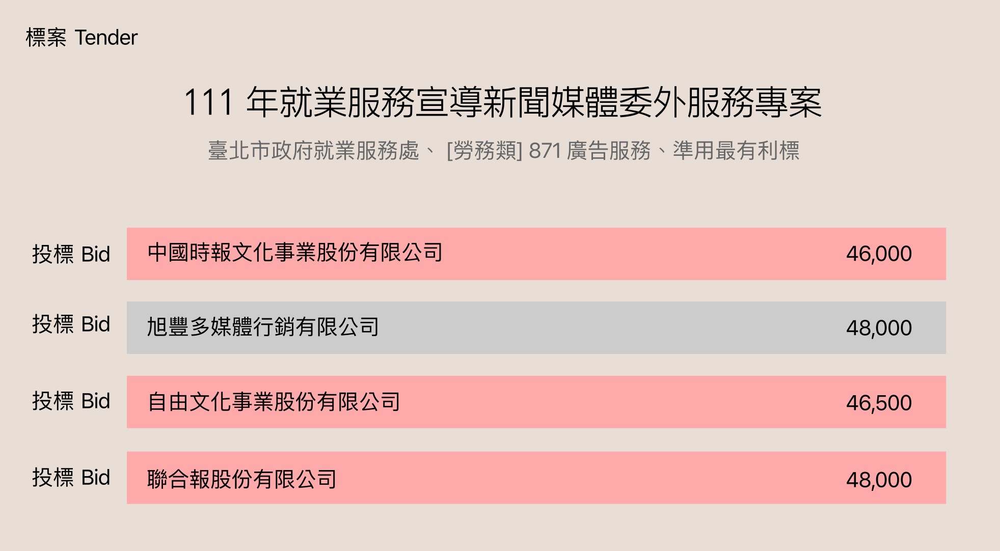
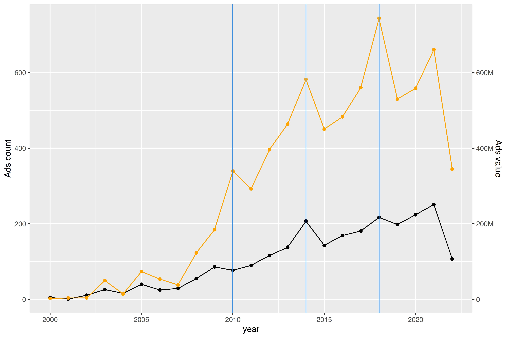
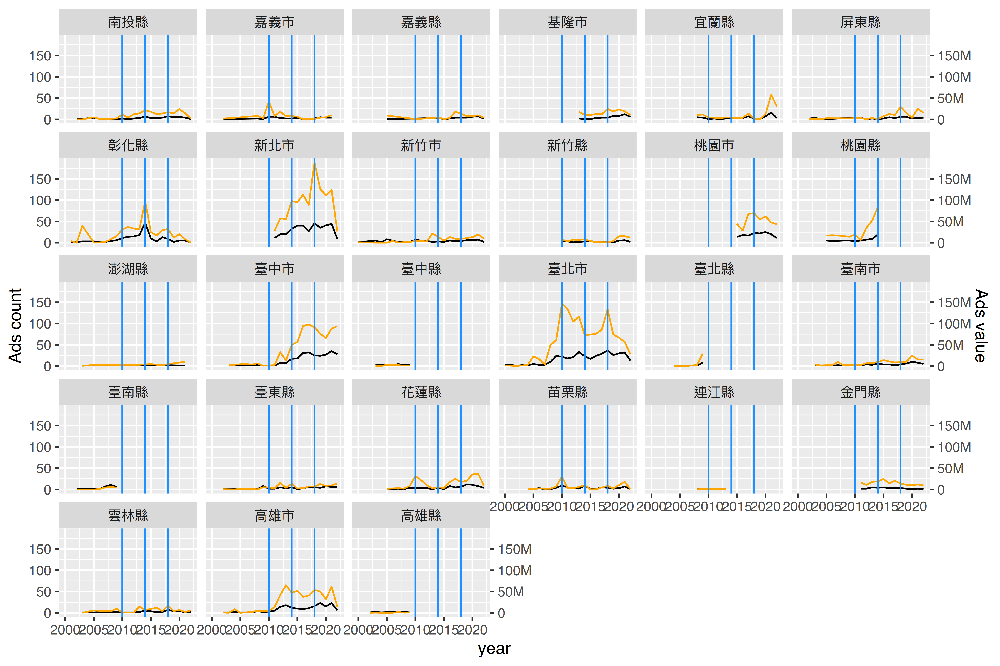
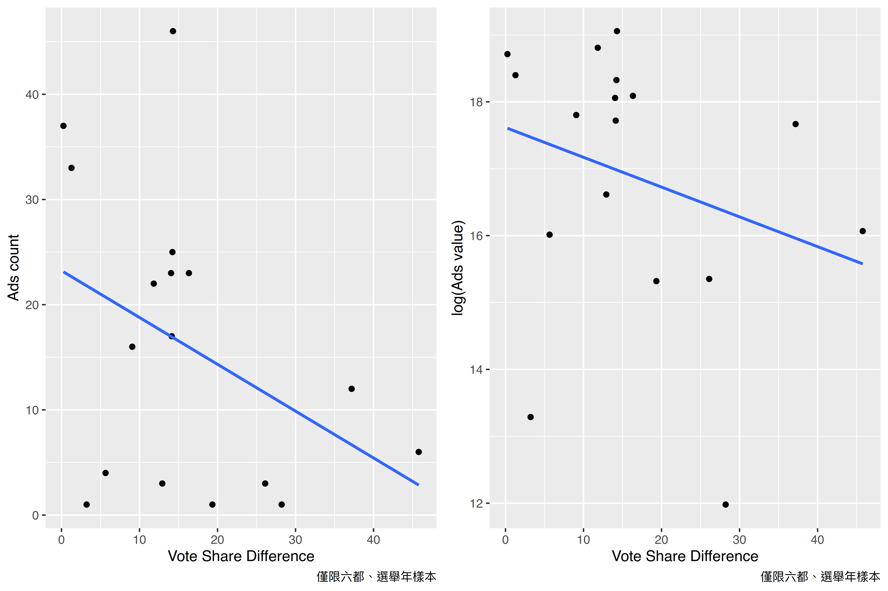
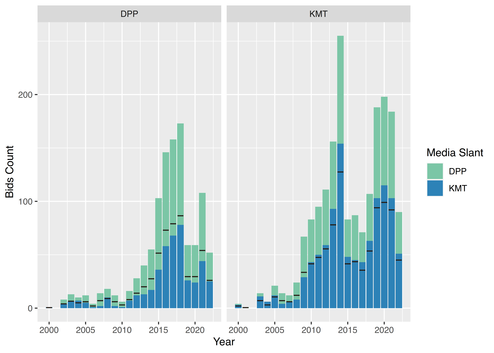

# Introduction

## Media Capture

::: columns

:::: {.column width=35%}

### Demand

Gov’s incentive to control media:

- Scandals
- Low reputaions
- Incoming elections

::::

:::: {.column width=60%}

### Supply

Media’s willingness to change their content

- Ads revenue from non-government sectors
	- Baldasty (1992), Petrova (2006): Prosperous ads market in late-19th boost independent news
- Media owner’s prefereces

::::

:::

# Data

- Government tenders from 政府電子採購網
	- 1999 - 2021
	- Keywords: 宣傳、宣導、推廣、廣告、報導、行銷、形象
	- Involved by major media conglomerates in Taiwan
- Variables: Issuer / Time / Winner / Value

---

{width=95%}

---

\include{tables/tenderSumTable.tex}

# Empirical Findings

## Upward Trend in Buying Ads

{width=75%}

---

## Ads Buying in Election Years 

{width=75%}

## Partisan Preference on Ads Budget

{width=70%}

---

{width=90%}

## Governors’ Preference on Aligned Media

::: columns

:::: {.column width=60%}

### Sample:

**Bids** to tenders that were...

- opened by KMT/DPP local governments.
- involved by both pan-blue/green media
	- 旺中、聯合、TVBS、自由、三立、民視
- governed by “Most Advantageous 最有利標” rule

::::

:::: {.column width=30%}

### Outcome

- Winning or not
- $\ln(\text{Value of the bid})$

::::

:::

### OLS Specification

$$
Y_{itcm} = \beta_0 + \beta_1 \text{Alignment}_{tcm} \times \text{Ruling}_{tc} + X_i + \delta_t + \delta_c
$$

for bid $i$, year $t$, opened by county $c$, and issued by media conglomerate $m$

---

\include{tables/regSumTable.tex}

---

\include{tables/regWinnerAlignment.tex}

---

\include{tables/regValueAlignment.tex}

# Conclusions

- Increased ads spending in election year, suggesting incumbency advantage.
- Both KMT and DPP have preference toward aligned media
  - while KMT prefers equalizing the value of tenders, DPP prefers giving pro-green media valuable cases
- Potential impact of decreased commercial ads on media capture
- Limits of the findings:
  - Lack of exogenous instrument to identify causal effect
  - Media’s *capability* unobserved
  - Differed public opinion might change government’s preference on buying ads
