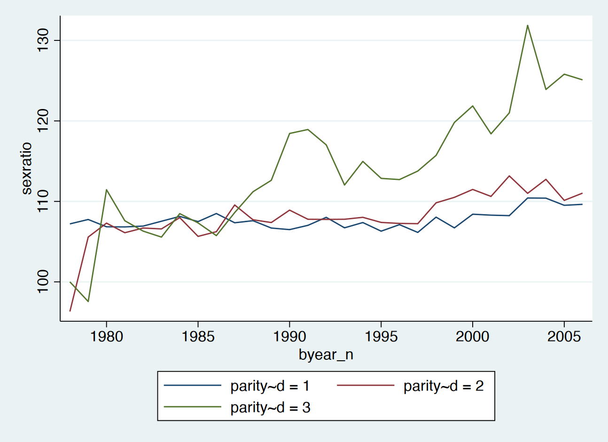
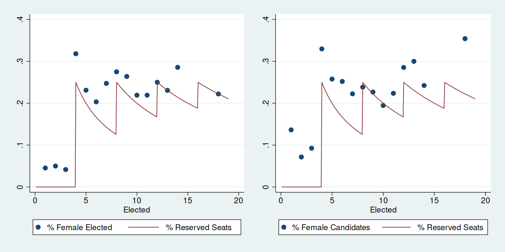
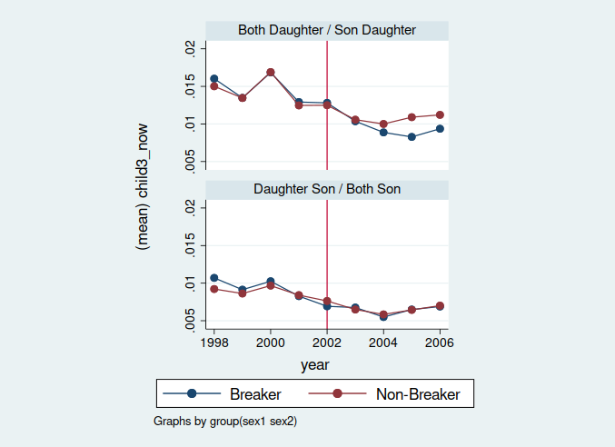

# Data and Identification Strategy

### Outcomes: Son Preference

1. Having 3rd child
2. Sex ratio of 3rd parity

From MOI Newborns Data between 1998 and 2006

- Samples: Couples who already have 2 children, deciding whether to have 3rd one.
- Transformed into balanced panel data by couple and year 

---

{width=80%}

---

### Survey Outcomes: Son Preference & Gender Role

Taiwan Social Change Survey

- Sample: Period 2001, 2006
  1. 「為傳宗接代，至少要生一兒子」
  2. 「一個家庭幾個小孩最理想」
- Sample: Period 2011, 2016
  - Gender role variables

---

Vote data from 1998, 2002, 2005 council elections.

### Instrument: % of reserved seats

- $Z_{ed} = \frac{\text{Reserved Seats 保留名額數}}{\text{Member Size 應選人數}}$, in election year $e$, electoral district $d$
- Determined by population size of electoral district.

### Potential Treatments

- % female elected
- % female candidates

Both could affect outcomes. Exclusion restriction not satistied. Thus I’ll present 1st stage and reduced form.

---

## 1st Stage Estimations

---

### 1st Stage specification
$$
X_{td} = \alpha + \beta_1 \text{\% Reserved Seats}_{td}  + \gamma_1 \ln \operatorname{pop}_{tc} + \delta_t + \delta_{c}
$$
in election year $t$, district $d$, county $c$

\include{tables/1ststage.tex}

# Results

## Birth Outcome: Having 3rd Child

{width=90%}

---

\include{tables/birth_child3_rf_panel.tex}

---

\include{tables/birth_sex3_rf_panel.tex}

## Survey Outcome

Sample: TSCS 2001 & 2006

\include{tables/TSCS_rf_son.tex}

## Survey Outcome: Gender Role

TSCS 2011 & 2016; 1 = Pro-female; 0 = Pro-male

\include{tables/TSCS_rf_role.tex}

# Remarks

- Weaken son preference: Higher satisfaction for couples without son.
- Women with lower educational attainment was more susceptible to exposure
- Survey confirmed decreasing son preference.
- No significant effect on gender role attitudes (after 2011)

## Possible Mechanisms

1. Role model effects:

   Interaction between female council member and female voters.

2. Policy effects:

   Public good provision, pro-female & childcare policies.
