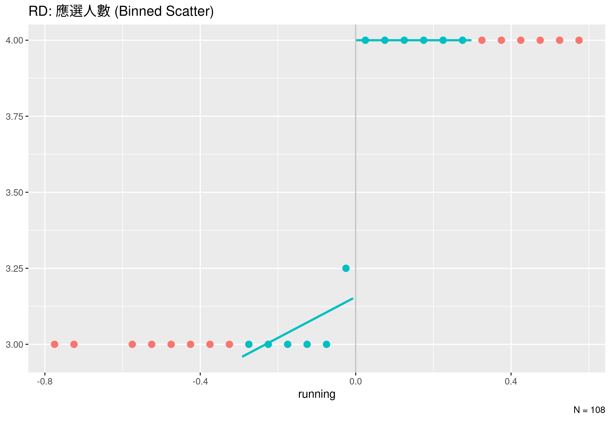

## 席次分配規則：黑爾商數最大剩餘數法

1. 計算分配一名額的人口基數：**縣市**人口數÷應選名額
2. 算出選區可以分多少人：FLOOR(選區人口數÷人口基數)
  1. 不足基數的選區分配一名
3. 餘數由大排到小，每選區分一名，至總應選人數達到規定為止

---

### 例：2010 年新北市議會選舉

1. 總人口數：3844081；應選市議員人數：62 人
2. 每席議員的人口基數：$3844081 \div 62 = 62001$

| 選區 | 人口數  | 分配席次 | 餘數  |
| :--: | :-----: | :------: | :---: |
|  1   | 211027  |    3     | 25024 |
|  2   | 631667  |    10    | 11657 |
|  3   | 583784  |    9     | 25775 |
|  4   | 550663  |    8     | 54655 |
|  5   | 411860  |    6     | 39854 |
|  6   | 234200  |    3     | 48197 |
|  7   | 588362  |    9     | 30353 |
|  8   | 333314  |    5     | 23309 |
|  9   |  70120  |    1     | 8119  |
|  10  | 229084  |    3     | 43081 |
|      | 3844081 |    57    |       |

---

| 選區 | 人口數 | 餘數  | 分配席次 |  餘數分配  | 最終席次 |
| :--: | :----: | :---: | :------: | :--------: | :------: |
|  4   | 550663 | 54655 |    8     |     1      |    9     |
|  6   | 234200 | 48197 |    3     |     1      |    4     |
|  10  | 229084 | 43081 |    3     |     1      |    4     |
|  5   | 411860 | 39854 |    6     |     1      |    7     |
|  7   | 588362 | 30353 |    9     | 1 (cutoff) |    10    |
|  3   | 583784 | 25775 |    9     |            |    9     |
|  1   | 211027 | 25024 |    3     |            |    3     |
|  8   | 333314 | 23309 |    5     |            |    5     |
|  2   | 631667 | 11657 |    10    |            |    10    |
|  9   | 70120  | 8119  |    1     |            |    1     |

## 應選 $3 \rightarrow 4$；保障 $0 \rightarrow 1$

{width=90%}

---

### 1st Stage

{width=100%}

## 應選 $7 \rightarrow 8$；保障 $1 \rightarrow 2$

{width=90%}

---

### 1st Stage: 女性當選比例 (Treatment)

{width=100%}