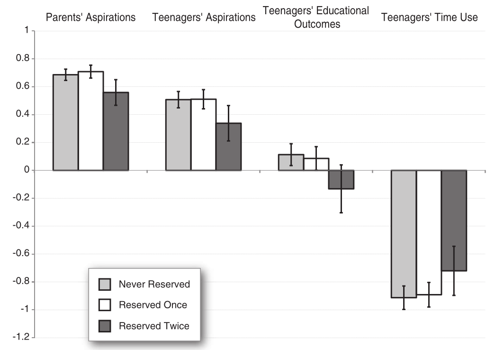
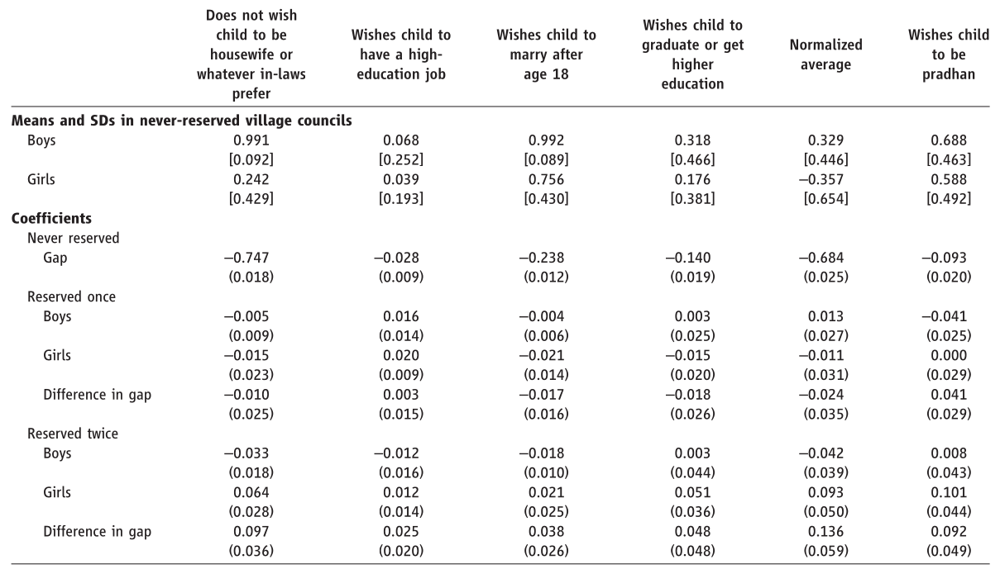
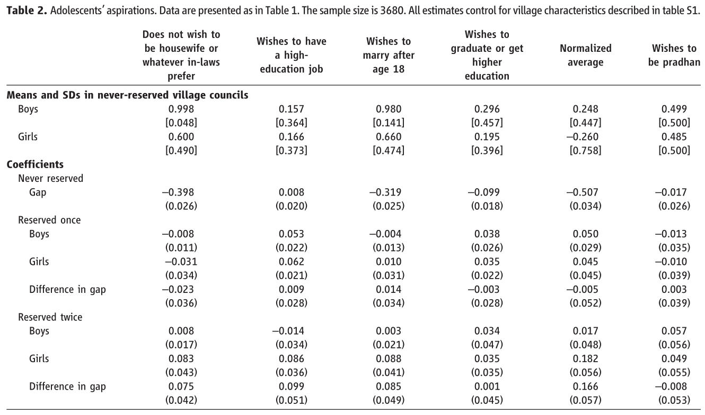
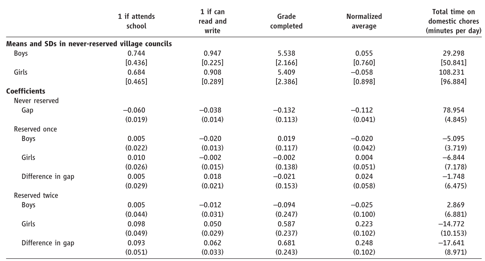
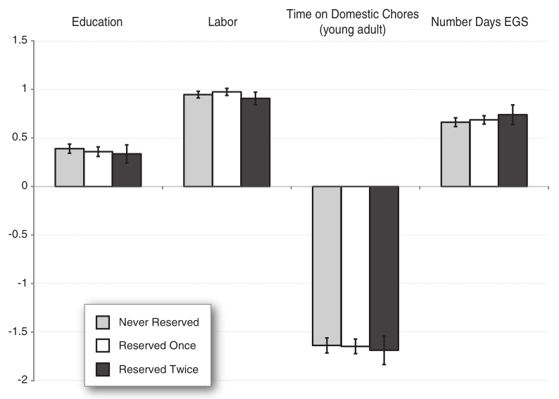

# Overview

Impact of female leadership on **aspirations**, **educational outcome**, and **time use**

- For parents: *What I expect my daughters and sons to do?*
- For adolecents:
    - Aspirations: *What can I achieve?*
    - Education: Attends school, literacy, grade completed
    - Time use: Time spent on domestic chores

Focus on change in **gender gap**

---

## Research Design

Leadership Shock: Quota for Female Villiage Leader

- Since Duflo is there, it's a RCT.
- 1993 Indian Constitution Amendment
    - ⅓ villiage head reserved for female, **randomly chosen**
- 3 Types of Villiages:
    1. Never reserved
    2. Reserved once
    3. Reserved twice

--

### Survey Data

- Collected at 2007
    - 2 elections in between: 1998, 2003
- Sample size:
    - Parents with adolecents child (aged 11-15): 2335 male & 2438 female
    - Adolecents: 1828 boys, 1852 girls

.dim[(Check: Only "dose" effect, no "time since first reservation" effect found)]

---

.caption[Fig 1: Gender Gap in Adolecents' Aspirations, Education, Time-Use]

.center[
Gap measure: Boys $-$ Girls
]

---

.caption[Table 1: Parents' aspirations for their children]

.center[
Gap coefficient: Girls $-$ Boys
]

---

.caption[Table 2: Adolecents' aspirations]

.center[
Gap coefficient: Girls $-$ Boys
]

---

.caption[Table 3: Adolecents' Education]

.center[
Gap coefficient: Girls $-$ Boys
]

---

## Mechanisms

1. **Phychological process**: role model directly change girls' self-perception
2. **Environment change**: policy enable girls' oppurtunities, promotes socio-economic status

--

## Test

To test these potential channels, author examine: *adolecent (11-15)* v.s. *young adult (16-30)*

.leftcol[
### Adolecents

- aged 11-15
- not yet exposed to environmental change in **education**, **labor market**, etc.
- Infer future expectation from young adult
]

.rightcol[
### Young Adults

- aged 16-30
- exposed to institutional change
- served as career indicator for adolecents
]

.bottomcol[
If young adults' socio-economic status are not affected due to female leadership, we are likely to reject mechanism (2)
]

---

.caption[Fig 2: Gender Gap in Young Adults' Socio-Economic Status]

.center[
Gap measure: Male $-$ Female
]

---

class: middle

# Conclusions

1. Exposure to female leader improve girls' aspiration, educational outcomes, time-use
2. Boys' aspiration was not diminished
3. Belief change is gradual and slow
4. Role model effect more likely than environmental change .dim[(induced by institutional amendment)]

--

That is, impact is more on **personal attitudes**, rather than **structural change**.

---

# To our research...

- No effect on female labor force participation
    - No labor market change
- No effect on gender gap of neonatal mortality
    - No reallocation of parents' health investment
    - Or no policy intervention into girls' healthcare

which is both consistent to the findings of Beaman et. al.

--

--- 

However, the underlying force of decreased fertility is either...

- demand: .dim[(mother-in-law's)] personal preference change
- supply: councilors block access to sex selection technologies

remains unknown.

--