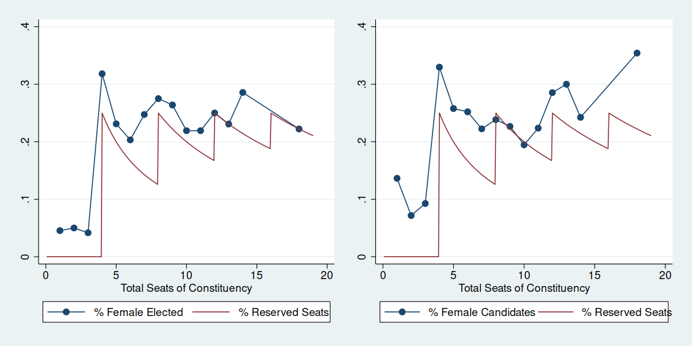
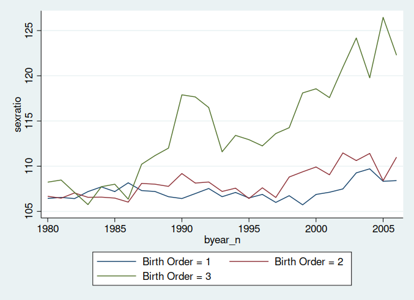
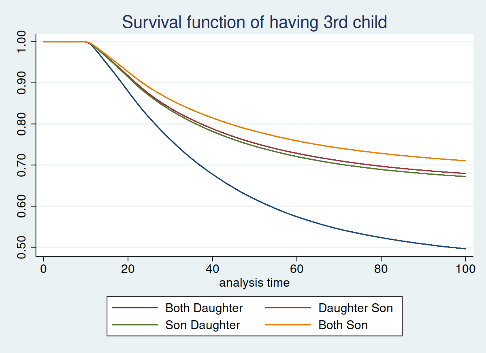

```{r setup, echo = FALSE, include=F}
library(knitr)
library(kableExtra)
library(magrittr)
library(tidyverse)
options(knitr.table.format = function() {
    if (knitr::is_latex_output()) {
        "latex"
    } else {
        "html"
    }
})
options(knitr.kable.NA = "")
knitr::opts_chunk$set(echo = F, message = F, warning = F)
```

# Introduction

Taiwanese women have a relatively well socioeconomic status:

- \textcolor{mLightBrown}{Gender Inequality Index}: Ranked as 6th place globally, top 1 among Asian societies
- \textcolor{mLightBrown}{> 40\% female legislators}: close to Scandinavian countries

What factors contributed to these achievements?

---

## Woman Reserved Seats in Taiwan

- Implemented since 1946, at national and county representatives elections
- For every 4 political seats (or 5 before 1999), 1 seat is reserved for female candidates.
- 14% ~ 25% female councilor for constituencies with $\geq$ 4 seats
- Man with lowest vote share get replaced by woman with highest vote share.

---

## Impact of Quota Policy in India

Policy intervention randomly reserves village head for female:

- Reduced bias toward female leader's performance
- Girls are more likely to enroll in schools
- Gender gap in educational attainment get closed
- Decreased mortality of higher-order girls
- More women running small business

Let woman becomes political leaders reduces gender gap well beyond political field.

---

## This paper

Examine the casual impact between \textcolor{mLightBrown}{political seats reservation} and \textcolor{mLightBrown}{son preference}

- A changing and prominent phenomenon of Taiwanese society
- A behavioral indicator for gender attitudes

---

# Data and Identification Strategy

## Data

- Councilor elections
- 1994, 1998, 2002, 2006

## Instrument: % of reserved seats

- $Z_{ed} = \frac{\text{\# Reserved Seats}}{\text{Total Seats}}$, in election year $e$, electoral district $d$
- Determined by population size of electoral district.

## Potential Treatments

1. % female elected
2. % female candidates

Both could affect outcomes. Exclusion restriction not satisfied. Thus I’ll present 1st stage and reduced form.

---

# First stage correlation

```{r first-stage, fig.cap="First Stage Correlations of IV and Treatments (2002 Council Election)", out.width="100%"}

```

---

# Main Outcome

## 3rd parity fertility (conditional on sex composition of first 2 children)
- An indicator for son preference
  - Mothers without son for first 2 parities likely to have additional birth
  - Strong sex selective practice in 3rd parity
- Data gathered from MOI birth record
  - 1994 - 2006, each observation merged with most recent electoral result with 1 year lag
  - Sample consists of mothers with 2 children, not yet having 3rd
  - Outcome = 1 if mother give birth 3rd child at year $t$, 0 otherwise.

---

```{r sexratio-by-parity, fig.cap="Sex Ratio at Birth by Parities", out.width="80%"}

```

---

```{r survival-child3, fig.cap="Kaplan–Meier Survival Function Estimate for 3rd Parity Fertility", out.width="90%"}

```

---

```{r birth-child3-rf}
cells <- readxl::read_excel("./tables/table.xlsx", sheet = "birth_child3_rf", .name_repair = "minimal", col_names = F)
table = cells[4:28, ]

kable(table, booktabs = T, linesep = "", caption = cells[1, 1], col.names = c("", cells[2, -1]), align = "lcccccc", escape = F) %>%
    add_header_above(c("", 1:6)) %>%
    add_footnote(str_split(cells[29, 1], "\n")[[1]], notation = "none") %>%
    kable_styling(full_width = F, latex_options = "scale_down")
```

---

```{r birth-sex3}
table <- readxl::read_excel("./tables/table.xlsx", sheet = "birth_sex3", .name_repair = "minimal", col_names = F)

kable(table[4:28, ], booktabs = T, linesep = "", caption = table[1, 1], col.names = c("", table[2, -1]), align = "lcccccc", escape= F) %>%
    add_header_above(c("", 1:6)) %>%
    add_footnote(str_split(table[29, 1], "\n")[[1]], notation = "none") %>%
    kable_styling(full_width = F, latex_options = "scale_down")
```

---

# Mechanism Discussion

## Benefit-Cost Hypothesis
- Willing to have daughter due to improved career prospect
- Daughters being more "valuable"
- **Test**: Gender gap in health investment

## Intrahousehold Bargaining
- Women preferred less children while men like to have sons
- Woman gains bargaining power, then her preference realized.
- **Test**: Household decision making

---

# Test for Benefit-Cost Hypothesis

## NHRI Mortality Record
- Outcome: Neonatal mortality
- Period: 2000 - 2008
- Boys and girls aged under 3
- Outcome = 1 if he/she dies under 3 years old, 0 otherwise.

---

# Neonatal Mortality Estimates

```{r death-rf}
cells <- readxl::read_excel("./tables/table.xlsx", sheet = "death_rf", .name_repair = "minimal", col_names = F)

table <- cells[4:20, ]

kable(table, booktabs = T, linesep = "", caption = cells[1, 1], col.names = c("", cells[3, -1]), align = "lcc", escape = T) %>%
    add_header_above(c("", 1:2)) %>%
    add_footnote(str_split(cells[21, 1], "\n")[[1]], notation = "none") %>% 
    add_footnote(str_split(cells[22, 1], "\n")[[1]], notation = "none") %>% 
    kable_styling(font_size = 7)
```

---

# Test for Intrahousehold Bargaining Hypothesis

## Survey on Social Development Trends, SSDT
- Outcome: Household decision making
  - Allocation of daily expenditure
  - Parenting
  - Saving & investment
  - Allocation of housework
- Period: 1998, 2002
- Sample limited to married individuals aged between 16 to 45

## Taiwan Social Change Survey, TSCS
- Outcome:
  - *In order to continue to patrilineal family, it's important to have at least one son*
  - Ideal number of children
- Period: 2001, 2006

---

# Household Decision Making Estimates

```{r SSDT-bargaining-rf}
table <- readxl::read_excel("./tables/table.xlsx", sheet = "SSDT_bargaining_rf", .name_repair = "minimal", col_names = F)

kable(table[5:18, ], booktabs = T, linesep = "", caption = table[1, 1], col.names = c("", table[3, -1]), align = "lccccc") %>%
    add_header_above(c("", 1:5)) %>%
    add_footnote(str_split(table[21, 1], "\n")[[1]], notation = "none") %>%
    kable_styling(full_width = F, latex_options = "scale_down")
```

---

```{r SSDT-bargaining-logit}
table <- readxl::read_excel("./tables/table.xlsx", sheet = "SSDT_bargaining_logit", .name_repair = "minimal", col_names = F)

kable(table[4:23, ], booktabs = T, linesep = "", caption = table[1, 1], col.names = c("", table[3, -1]), align = "lcccc") %>%
    add_header_above(c("", 1:4)) %>%
    pack_rows("Woman decides over man decides", 1, 6) %>%
    pack_rows("Mutually decides over man decides", 8, 13) %>%
    add_footnote(str_split(tail(table, 1)[[1]], "\n")[[1]], notation = "none") %>%
    kable_styling(full_width = F, latex_options = "scale_down")
```

---

# Self-reported Son Preference Estimates

```{r TSCS-birth-pref-rf}
table <- readxl::read_excel("./tables/table.xlsx", sheet = "TSCS_son_rf", .name_repair = "minimal", col_names = F)

kable(table[4:16, ], booktabs = T, linesep = "", caption = table[1, 1], col.names = c("", table[2, -1]), align = "lcccccc") %>%
    add_header_above(c("", 1:6)) %>%
    add_header_above(c("", "Important to have at least one son" = 3, "Number of children willing to have" = 3)) %>%
    add_footnote(str_split(tail(table, 1)[[1]], "\n")[[1]], notation = "none") %>%
    kable_styling(full_width = F, latex_options = "scale_down")
```

---

# Conclusions


