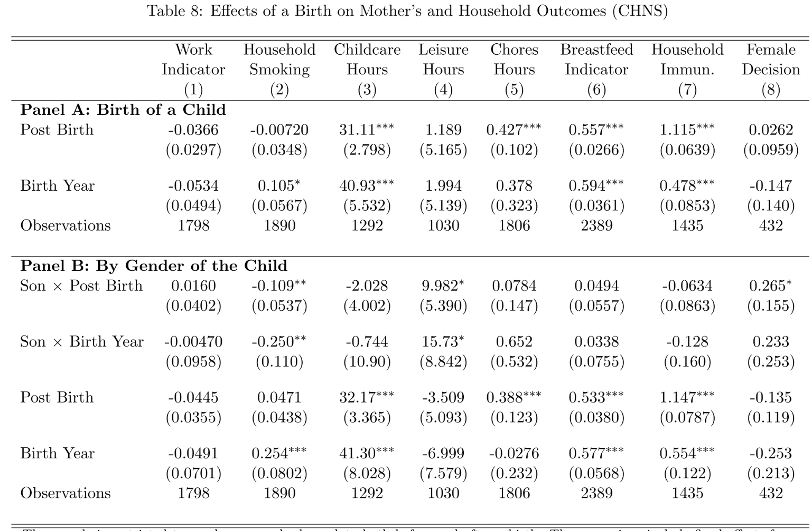

# Wang, Shing-Yi,  The Labor Supply Consequences of Having a Child in China,  (2022)

Impacts of child birth on:

1. Parents’ labor supply
2. Household income & expenditure
3. Time use

with specific focus on heterogeneous effect by gender of the child

-> son preference

 ## Data

- National Fixed Point Survey
  - Individual level panel data from 2003 to 2010
  - Mainly rural households
  - Unbalanced panel, 2285 births observed
  - Used for labor supply, household expenditure outcomes

More than half of women participate in family occupation, most of them in agricultural industry.

Suggesting that the drop-out of labor force is not induced by lacking of flexibility measures (e.g. maternity leave), but more likely induced by change in household preference (within family rearrangement).

- China Health and Nutrition Survey
  - 10 waves, 1989 to 2015
  - Limited to rural households
  - Unbalanced panel
  - Used for time-use, household decision-making outcomes

## Empirical Specification

Twoway fixed effect model:
$$
y_{i t}=\alpha+\sum_{j=-3}^7 \beta_j \text { Birth }_{it, j}+\tau_t+\gamma_i+\epsilon_{i t}
$$
for individual $i$ at calendar year $t$, event time $j$. 

$\beta_{-1}$ was omitted as benchmark. Standard errors clustered at individual level.

- Event study, j = -3 ~ 7
- Report change in outcome compared with t = -1

## Empirical Results

### Labor Force Participation

Women: 10% ↓

Men: 2.4% ↑

Results are similar for balanced panel and additional controls.

### Hetero. Effect by Gender of Child

Identify the “son effect” using:
$$
y_{i t}=\alpha+\sum_{j=-3}^7 \beta_j \text { Birth}_{i t, j} \times \text { Son}_i+\sum_{j=-3}^7 \delta_j \text { Birth}_{i t, j}+\tau_t+\gamma_i+\epsilon_{i t}
$$

---

---

- Concern: gender of child might be endogenous
	- E.g. Families that are sex-selecting a son would prefer women being as housewife, not working women.
- Assumption: gender preference is time-invariant
	- Panel data w/ fixed effect would capture this household characteristic.
- Robustness Check
	1. No significant difference in pre-birth characteristics between son v.s. daughter group
	2. Parallel pre-trend
	3. Sub-sample of first-born children: less skewed sex ratio
	4. Artificially balance the sex ratio by assigning male births to female births

---

## Mechanism

What makes mothers work less when having a son compared with having a daughter?

### Investment in Son?

Marginal return of childcare investment in sons > investment in daughters.

#### Test

Gender gap in other types of observable investments: cigarette/dairies/meat consumption

Result: No difference except reduced cigarette consumption

---

---

### Household Preference for Mother with a Son?

In son-preferring families, mothers are rewarded for producing a son.

> 能生兒子的媳婦才是好媳婦

#### Empirical Evidence

For mothers after the birth of a son:

1. ↓ Agricultural work
2. ↑ Mothers’ education
3. ↑ Participation in household decision-making
4. ↑ Leisure

---

---

---

## Conclusions

- Child penalty in Denmark are larger in magnitude and more persistent in time
	- Denmark: Induced by rigidity in formal sector job.
	- Rural China: Rearrangement of labor force in family enterprise.
- Household preference, instead of labor market arrangements/discrimination, is at play.
