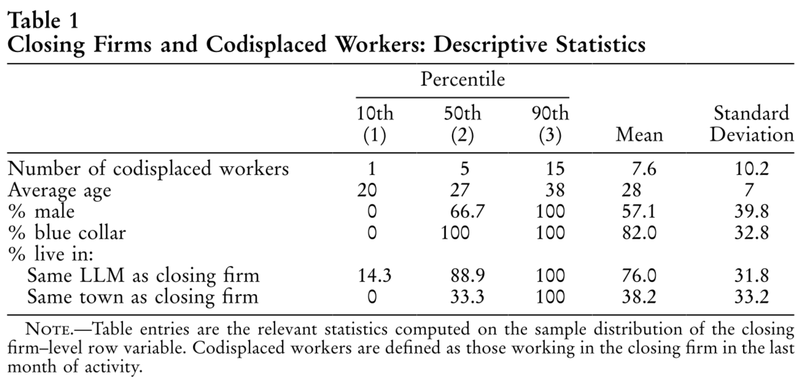
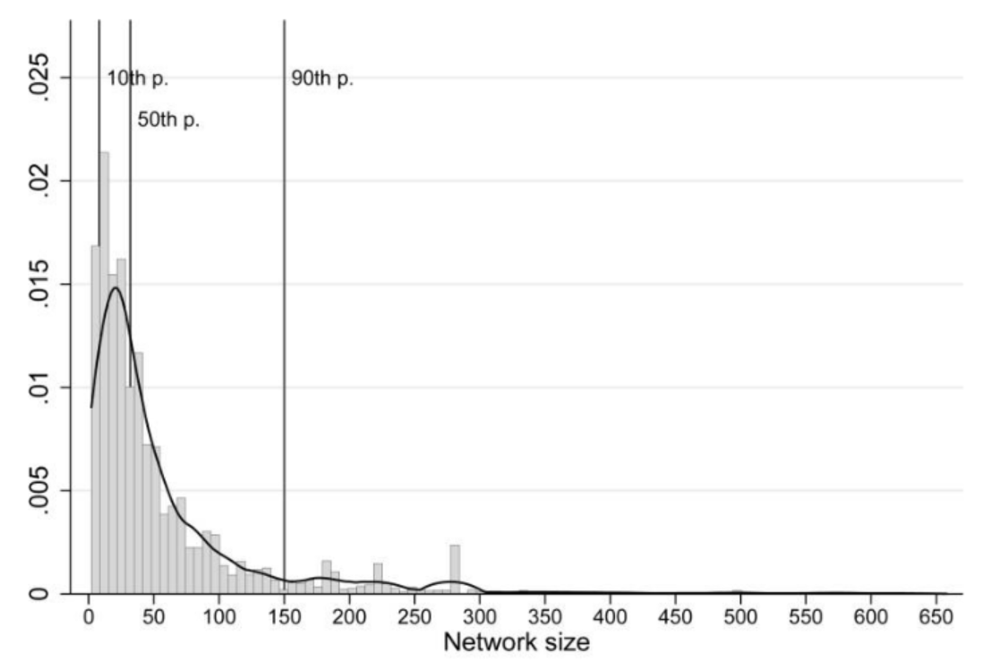
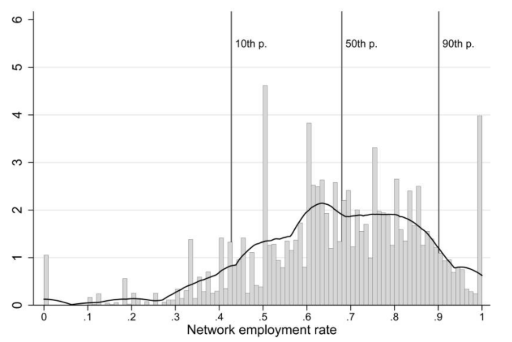
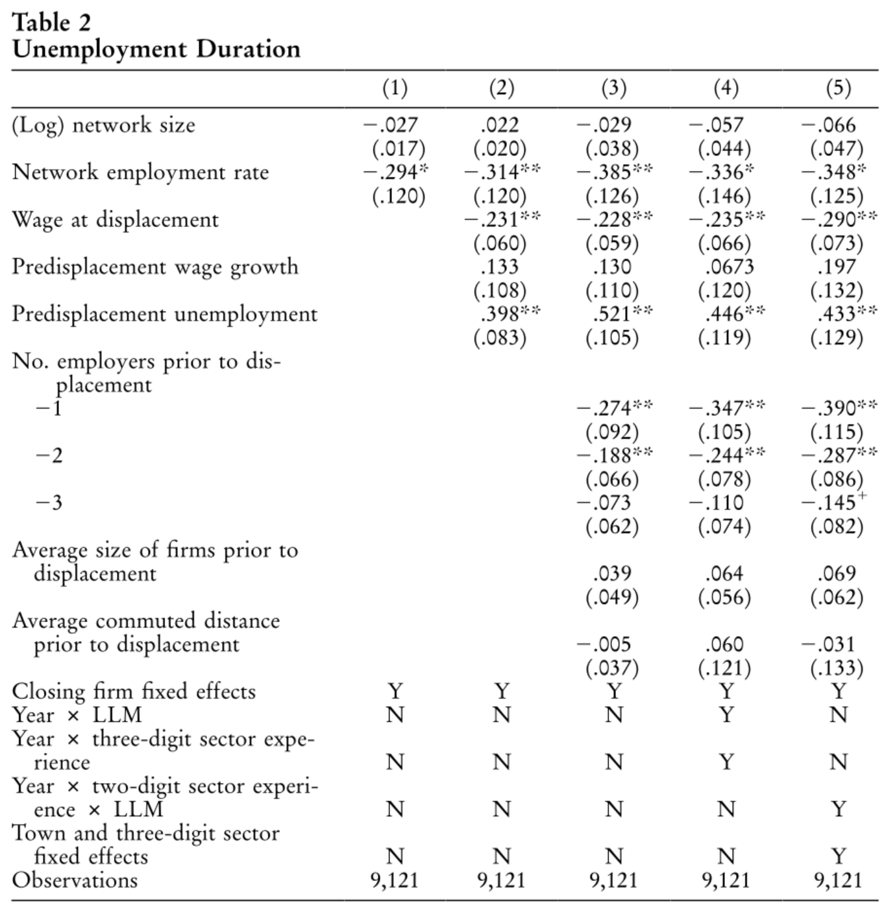
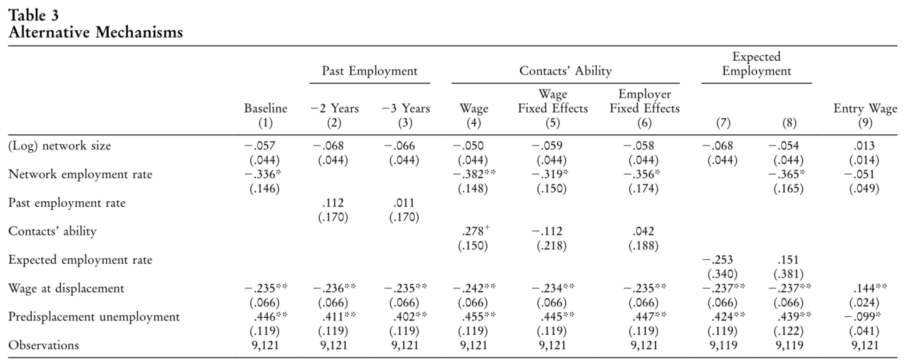
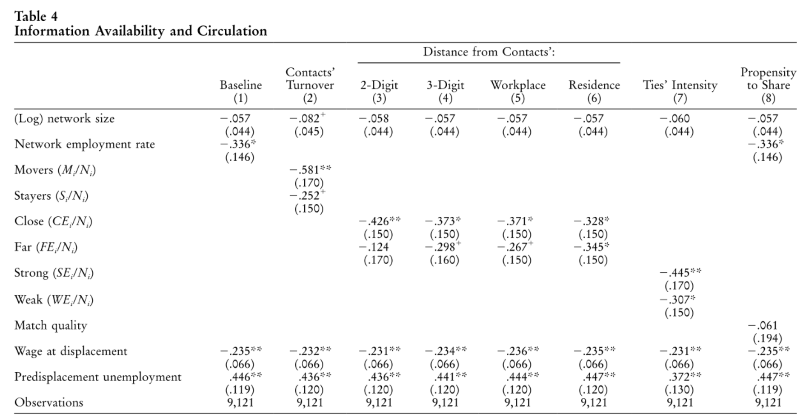
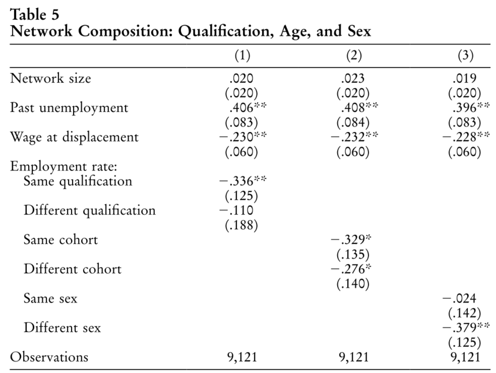
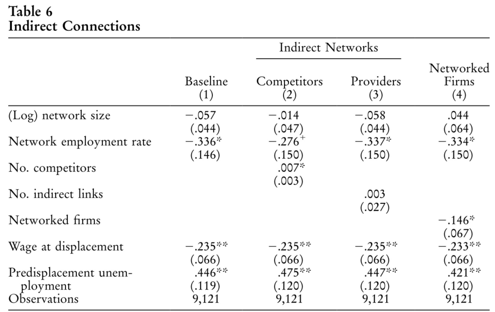

# Overview

- Information is essential during job search
  - Market conditions, job opportunities, etc.
- Does insider information facilitates job search? By how much?
  - Knowing someone nears the job opportunity → reduces search costs → shorter unemployment spell

This paper:

- Estimate the causal effect of **network employment rate** on **unemployment duration**
- Mechanism: **information sharing**

We focus on identification strategy and how authors justify their causal interpretation

::: {.notes}

Information is an essential input in the job search process. Imagine you are looking for a job. You need to know the market conditions -- how many hirings are taking place this year; job opportunities -- are their any interesting jobs available now, etc. You'll look up job postings, ask friends, and maybe past companies that you've interned at.

One particular interesting question that the authors trying to ask is: does insider information help? If you know someone who is near the job opportunity, does it help you find a job faster? If so, by how much?

This paper tries to identify the causal effect of network employment rate on unemployment duration. **That is, the more of your friends are employed, is your unemployment spell shorter?** They isolate the effect goes through information sharing mechanism are rules out other potential mechanisms. We'll discuss how they define the network later.

The result itself is quite intuitive. And to be honest there is no technicality in their empirical approach.

But I do think their identification strategy and how they justify their causal interpretation is worth discussing.
:::

# Empirical model

Consider a model of network effects on unemployment duration:

$$
u_i = \alpha + \gamma ER_{it_0} + \theta \log(N_{it_0}) + X_{it_0} \beta + e_{it_0}
$$

- $u_i$: (log) unemployment duration of invidivual $i$
- $ER_{it_0}$: network employment rate at the time of displacement $t_0$

**Baseline definition of network** $W_{it_0}$:

- Coworkers of individual $i$ in $[t_0 - 5, t_0]$ with at least 1 month of overlap
  - Past coworkers network provide more valuable job information than other networks
- Individual-specific: key to the identification strategy

::: {.notes}

Let's jump into the baseline model first. When you're thinking about this kind of question, you may firstly want to set up an equation like this. 

The LHS is the log of unemployment duration of individual $i$ -- how much time do individual $i$ spent to find her next job. The RHS is the network employment rate at the time of displacement $t_0$ -- at the time you lose your job, how many of your network members are employed. We are interested in $\gamma$, and we have a prior on it to be negative, suggesting that the higher the ER is, the lower of your unemployment spell.

The network is defined as coworkers of individual $i$ in the past 5 years. This is a reasonable definition because past coworkers are more likely to hold valuable job information than, say, your hobby network. More realistically, the reason they define the network in this way is that it's more easy to obtain data on past coworkers.

Note that the network definition is individual-specific, which is key to the identification strategy as we'll show later.

:::

# Identification challenges

$$
u_i = \alpha + \gamma ER_{it_0} + \theta \log(N_{it_0}) + X_{it_0} \beta + e_{it_0}
$$

Problem: $ER_{it_0}$ is non-random

The relationship between $ER_{it_0}$ and $u_i$ has various sources of endogeneity:

1. Self-select to quit jobs
2. Unobserved worker characteristics
3. Common local labor market shocks

---

1. Self-select to quit jobs
    - Workers with better $ER_{it_0}$ are more likely to quit and have lower $u_i$
    - Biased sample: only observe workers who *actually* quit
    - **Solution**: exogenous job displacement -- firm shutdown
      - Workers in the same shutdown event are dropped from $W_{it_0}$
2. Unobserved worker characteristics
    - High-ability workers have better $ER_{it_0}$ and lower $u_i$
    - **Solution**: (i) closing firm fixed effects; (ii) control for observable employment history
      - Make comparison across workers within the same shutdown firm
        - Absorb unobserved dimensions that appear in sorting behavior
      - Control wage history and tenure, which proxies for ability

::: {.notes}

The first problem is self-selection. Even if there is no network effect, you can still observe a negative correlation between network employment rate and unemployment duration. This is because workers with better network employment rate are more likely to quit their jobs and have lower unemployment duration. 

In firm shutdown, you're forced to quit your job. This mitigates the self-selection bias. And they drop workers in the same shutdown event from the network, because all of them experience the same circumstance as you, so unlikely to provide extra information.

Another challenges is unobserved worker characteristics. High-ability workers are more likely to have better network employment rate and lower unemployment duration. To control for this, they add closing firm fixed effects. You may argue that, even within the same firm, workers are still very different. Some workers are more skillful than others, hence knowing more friends who are employed and likely to find a job in a shorter time. To absorb these unobserved dimensions, they control for observable employment history, such as wage history and tenure, which are proxies for ability.

:::

---

3. Common local labor market shocks
    - Worker and her coworkers are subject to common labor market shocks
    - Think about workers' network in Hsinchu Science Park when TSMC is booming
    - **Solution**: add labor market fixed effects

::: {.notes}

Another confounder is the common local labor market shocks. You and your coworkers are subject to the same labor market conditions. For example, if you and your past coworkers are all working in Hsinchu Science Park, and TSMC is booming, you and your coworkers are more likely to find a job faster. ER goes up and unemployment duration goes down, but this has nothing to do with the network effect. To control for this, they add local labor market fixed effects.

:::

## Wrap up

1. Exogenous job displacement: Firm shutdown
2. Unobserved worker characteristics: 
   1. Closing firm fixed effects: within-closing-firm comparison
   2. Observable individual and network characteristics: wage history, tenure, etc.
   3. **Caveat**: unobservables not revealed through sorting are not controlled (e.g. differential skill accumulation)
3. Local labor demand shocks: local labor market (LLM) fixed effects 

# Data

- Employer-employee linked panel from 2 Italian provinces, 1975-1997
  - Demographic: age, gender, place of birth, residence
  - Job & employer information: weekly earnings, tenure, industry, location
  - Taiwanese equivalent: labor insurance data
- Consider only shutdown events in 1980-94
  - 5-year window for network definition
  - 3-year window for unemployment spell completion
    - median = 5 months; mean = 10 months; minimal censoring

::: {.notes}

- unemployment spell: median = 5 months; mean = 10 months
  - censoring is minimal

:::

---

::: {.notes}

- The estimation sample: Closing firms are small, their workers are young, mostly blue-collar male.
- This group of people may be of particular interest, but at the same time it may not reflect other workers like white-collar workers.
  - We may actually expect the network effect to be stronger among white-collar

:::

---

::: {#fig-network layout-ncol=2}

Network characteristics (Cingano and Rosolia 2012, Figure 1)

:::

::: {.notes}

- Power law distribution of network size, long tail on the right
- Median network size: 32
  - A reasonable amount of contacts
  - Discuss measurement error in the end
- Rich variation in network employment rate

:::

# Baseline results

:::: {.columns}

::: {.column width=55%}

:::

::: {.column width=45%}

LHS: log unemployment duration

 

Estimated elasticity: -0.3

10 ppt ↑ network employment rate

⇒ 3% ↓ unemployment duration 

⇒ (1.2 weeks ↓)

:::

::::

::: {.notes}

1. First column only controls for closing firm fixed effects
2. Second column adds observable individual ability proxies
3. Third column adds tenure information
4. Fourth and fifth column adds local labor market fixed effects

:::

# Interpretation

Network effects ≠ Information sharing effects

1. **Information sharing**: Someone proximated to job opportunities shares those information
    - search costs ↓ ⇒ duration of job search ↓
2. **Peer pressure**: Knowing most of your friends are working, you feel more pressure to find a job
    - reservation wage ↓ ⇒ duration of job search ↓
3. **Expectation**: Knowing most of your friends are working, you think the labor market is booming
    - reservation wage ↑ ⇒ duration of job search ↑

Authors conduct falsification tests to reject (2) and (3)

## Falsification excercises

2. **Peer pressure**: 
    1. Use lag network employment rate: if pressure exists, should be a significant predictor
    2. Control for contacts' ability: if pressure exists, $\hat\gamma$ should become smaller
        - Proxies for contacts' ability: (i) wage (ii) tenure
3. **Expectation**:
    - Model the expectation on contacts' employment using a probit model:
      $\Pr(E_{jt_0}) = \Phi(\text{age, time, location})$
    - Get $\widehat\Pr{E_{jt_0}}$, take average over contacts, and use it as a control variable
    - If expectation matters, $\hat\gamma$ should become smaller

::: {.notes}

1. If peer pressure is true, then not just your past workers' performance today would give you pressure, but also their performance in the last year.
2. Peer pressure may be related to contacts' ability. If you control for contacts' ability, the effect of network employment rate should be smaller.
:::

---

::: {.notes}
Conclusion: Peer pressure and expectation are not major mechanisms.
:::

## Information availability

Some contacts are more likely to hold valuable job informations:

- Switch jobs recently
- Work in the same industry / nearby workspace
- Live nearby
- Stronger ties (being coworkers for a longer time)

::: {.notes}

Now we know the mechanism that matters is informational sharing. But not all contacts are equally valuable. Some contacts are more likely to hold valuable job information. For example, contacts who switch jobs recently, work in the same industry or nearby workspace, live nearby, or have stronger ties (being coworkers for a longer time) are more likely to provide valuable job information.

:::

---

::: {.notes}

These results suggest that information sharing is a plausible mechanism.

:::

# Heterogeneity by network composition

# Indirect connections

:::: {.columns}

::: {.column width=40%}

- **Competitor**: Contacts' contacts may compete with you for the same job

- **Provider**: Contacts' contacts may help you find a job

- **Diverse contacts** provide less duplicated information

:::

::: {.column width=60%}

:::
::::

# Takeaways

- **Information sharing** in social networks facilitates job search
  - **Positive spillover** of one's employment status to network members
- **Identification strategy**: 
  - Exogenous job displacement
  - Closing firm fixed effects
  - Observable individual and network characteristics
  - Local labor market fixed effects

