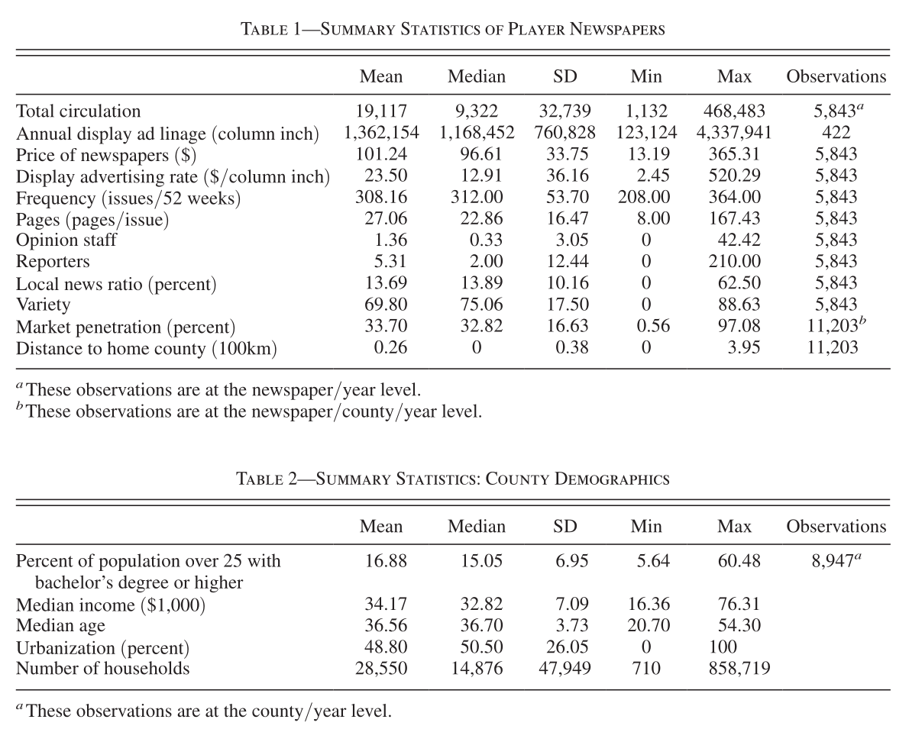
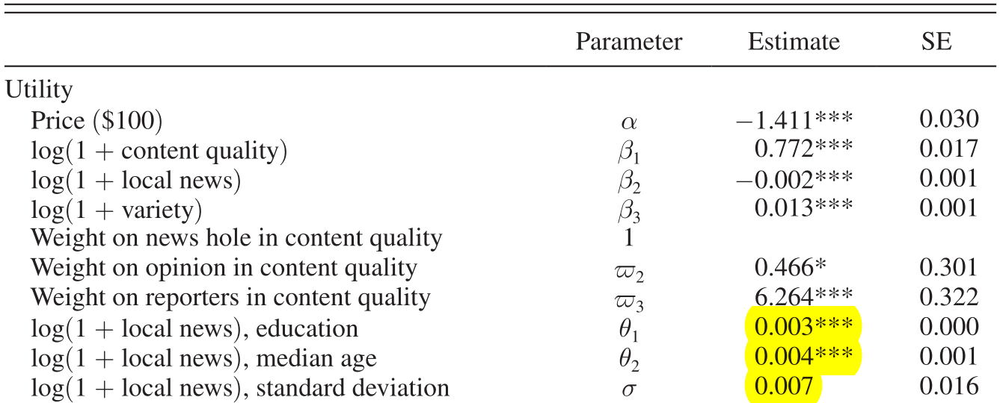
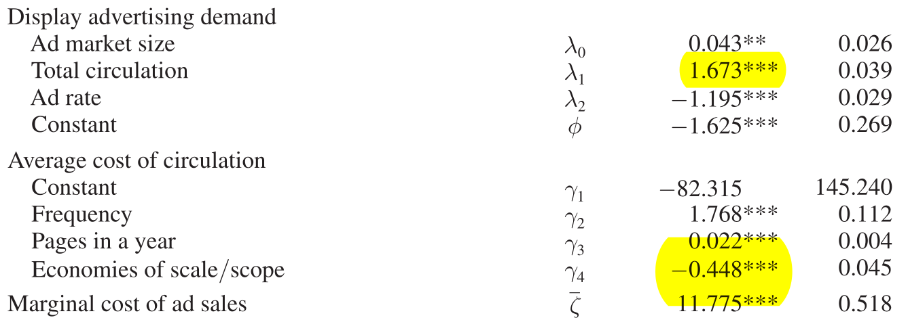
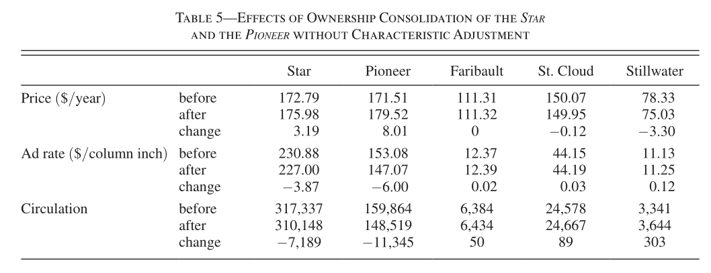
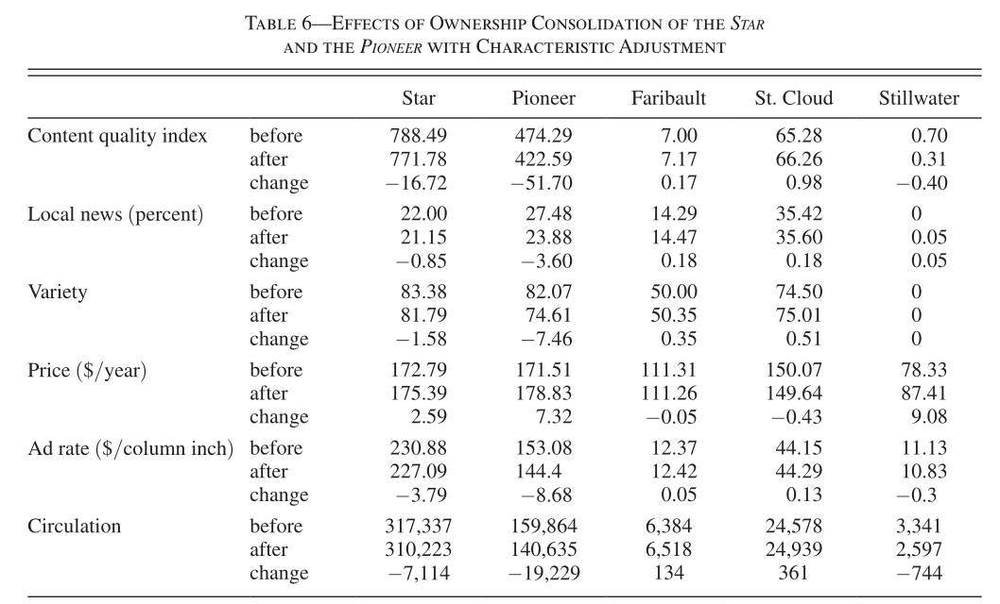
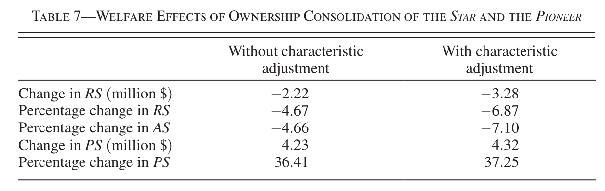
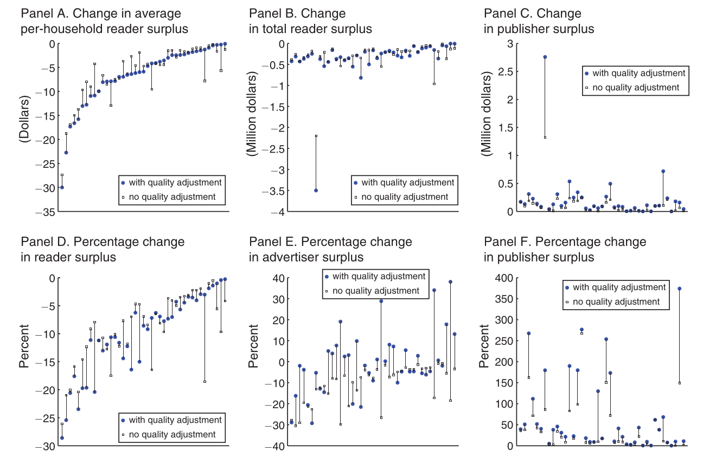
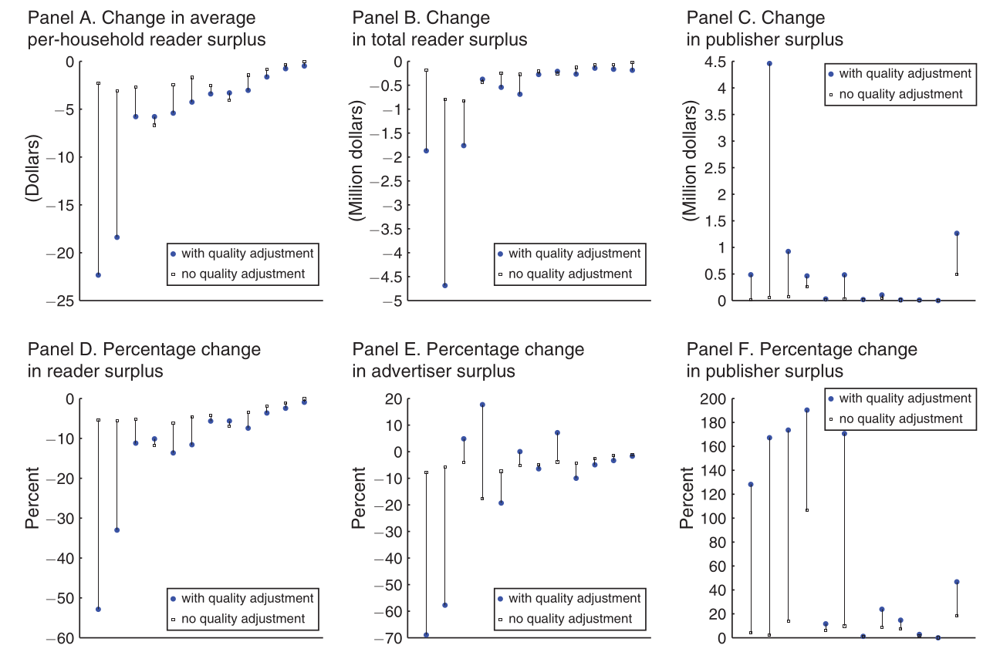

# Motivation

- Standard merger analysis omits the role of **product characteristics**
- Underestimate welfare loss for consumers / gain for firms

This paper:

- Examine the US daily newspaper market
  - Endogenize: price & editorial decisions
- Counterfactual analysis
  - A banned merger of 2 newspapers in Minneapolis-St. Paul metro area
  - Duopoly and triopoly mergers

# Model Overview: Features of the Newspaper Market

- 3 types of agents: readers, advertisers, publishers
  1. Readers: subscribe to ≤ 2 newspapers per year
  2. Advertiser: demand for advertising space
  3. Publisher: maximize (joint) profit from subscription & advertising revenue
- Newspapers have differentiated characteristics
  - Endogenous: annual subscription price, content quality, local news ratio, variety

# Model - Reader's Demand

Utility of subscribing to newspaper $j$, for household $i$ in county $c$ in year $t$:

$$
u_{i j c t} = 
p_{j t} \alpha
+ \underbrace{{\bf x}_{j t}}_{\text{endo. chars.}} \boldsymbol\beta_{ict}
+ \underbrace{{\bf y}_{j c t}}_{\text{exo. chars.}} \boldsymbol\psi
+ \underbrace{{\bf z}_{c t}}_{\text{demographics}} \boldsymbol\varphi
+ \xi_{j c t} + \varepsilon_{i j t}
$$

Random coefficient for $k$-th endogenous characteristics:

$$
\beta_{kict} = \beta_k + {\bf z}_{c t} \boldsymbol\theta_k + \sigma_k\varsigma_{kict}
$$

Outside choice [(decreasing interest in reading newspapers)]{.dim}

$$
u_{i0t} = (t - t_0) \rho + \varepsilon_{i0t}
$$

## Product Characteristics

- Endogenous ${\bf x}_{j t}$:
  1. Content quality: $x_{1j t} = x_{11j t} + \varpi_{2}x_{12j t} + \varpi_{3}x_{13j t}$
      - $x_{11j t}$: nonadvertising space
      - $x_{12j t}$: \# staff for opinion section
      - $x_{13j t}$: \# reporters
  2. Local news ratio
  3. Variety: HHI of share of staff in each section
- Exogenous ${\bf y}_{j c t}$:
  - \# households in the market, morning edition, local newspaper, distance to newspaper's home county

## Reader's multiple discrete choices problem

Assume each household subscribes to **at most 2 newspapers**

**Market penetration** = the probability of subscribing to newspaper $j$:

1. $j$ is the best choice: $\mathrm{Pr}\left(u_{i j c t} \geq \max_{h=0,\,\dots,J_{c t}}u_{i h c t}\right)$

2. $j$ is the second best:
  $$
  \sum_{j' \neq j} \mathrm{Pr} \bigl(
    \underbrace{u_{i j' c t} \geq u_{i j c t} \geq \max_{h \neq j'} u_{i h c t}}_{j \text{ ranked 2nd}}, \;\;
    \underbrace{u_{i j c t} - \kappa}_{\text{gains from 2nd}} \geq u_{i 0 c t}
  \bigr)
  $$

where

- $J_{c t}$: set of newspapers in county $c$ in year $t$
- $\kappa$: disutility for subscribing to the second newspaper

# Model - Advertiser's Demand

Consider a Cobb-Douglas form of advertising demand:

$$
\begin{aligned}
a \left(r_{j t}, q_{j t}, H_{j t}; \eta, \boldsymbol{\lambda} \right)
&= e^{\eta} H_{j t}^{\lambda_{0}} q_{j t}^{\lambda_{1}} r_{j t}^{\lambda_{2}} \\
\log a_{j t}
&= \eta + \lambda_{0} \log H_{j t} + \lambda_{1} \log q_{j t} + \lambda_{2} \log r_{j t} + \iota_{j t}
\end{aligned}
$$

- $H_{j t}$: # of households in newspaper $j$'s circulation area
- $q_{j t}$: total circulation
- $r_{j t}$: advertising rate

# Model - Supply

Overlapping are prevalent. We have to define **markets** where newspapers strategically interact with each other.

1. National newspapers are taken as exogenous: *WSJ, NYT, USA Today*
2. For each newspaper, drop trivial counties that circulate almost no copies
3. Economies of scope only exist in the home market (defined by *MSA*)

Newspaper's sources of revenue:

1. Subscription revenue
2. Preprint advertising revenue
3. Display advertising revenue

# Supply - Publisher's Profit Maximization Problem

In a two-stage game, a publisher $j$ decides on:

1. Make editorial decisions (choose $\bf x_{jt}$)
2. Set price $p_{jt}$ and advertising rate $r_{jt}$

to maximize profit:

$$
\pi_{j}^{\mathrm{I}}(\mathbf{x})
= \underbrace{\pi_{j}^{\mathrm{II}}\left(\mathbf{p}^{*}(\mathbf{x}), \mathbf{r}^{*}(\mathbf{x}); \mathbf{x}\right)}_{\text{2nd stage profit}}
- \underbrace{\operatorname{fc} (\mathbf{x}_{j}, \boldsymbol\nu_{j}; \boldsymbol\tau)}_{\text{quadratic fixed costs}}
$$

where

- $\mathbf{p}^{*}(\mathbf{x})$: equilibrium price vector
- $\mathbf{r}^{*}(\mathbf{x})$: equilibrium advertising rate vector
- $\boldsymbol\nu_{j}$: unobservable cost shocks

# Supply - Cost & Profit Functions

- Average costs per copy:
  $$
  a c_{j}^{(q)} = \bigl(\gamma_{1} + \gamma_{2}f_{j} + \gamma_{3} \underbrace{\big(x_{1j} + a_{j}\big)}_{\text{pages}}\bigr) \underbrace{\log{(Q_{j})^{\gamma_{4}}}}_{\text{decreasing in total qty}} + \omega_{j}
  $$
- Ad profit: 
  $$
  \bigl(r_j - \underbrace{(1 + 1 / \lambda_{2}) \bigl(\overline{{{\zeta}}}+\zeta_{j} \bigr)}_{\text{MC of ad sales}}\bigr) \cdot \underbrace{a_j}_{\text{convex in qty}}
  $$
- Preprint profit: $\mu_1 q_j + \frac{1}{2} \mu_2 q_j^2$

Intuitively, scale economies may come from **lower average costs** & **higher ad demand**.

# Data

- 1997-2005
- Reader side:
  - county circulation, annual subscription price
- Advertiser side:
  - annual display ad linage, display ad rates
- Publisher side:
  - 422 newspapers per year
  - Joint Operation Agreement

## Summary Statistics

# Estimation

Apply GMM. Moment conditions are from:

- Demand system: (1) Newspaper demand; (2) display ads demand
- Equilibrium conditions: FOC of the profit maximization problem
  - \(3\) advertising rate
  - \(4\) price
  - \(5\) editorial decisions (endogenous characteristics)
- Excluded instrument: the demographics in the market of $j$'s competitors (excluding $j$'s own market)
  - Relevant for the decision of $j$'s competitors, hence $j$'s decision
  - Exclusion restriction: only affect $j$'s demand through its competitors
  - Education, income, age, urbanization

# Parameter Estimates

::: {#fig-parameters layout-ncol=2}

Estimation Results
:::

There are economies of scale ($\hat\lambda_1 > 1, \hat\gamma_4 < 0$).

$\kappa = 1.919$ → Duplicate readership is negligible in about 45% of counties with multiple newspapers

# Counterfactual Analyses

## Merger of *Minneapolis Star Tribune* & *St.Paul Pioneer*

:::: {.columns}

::: {.column}
- 2006: The publisher of the *Star* acquired the publisher of the *Pioneer*
- 3 months later blocked by Department of Justice
- The *Pioneer* was sold to a third party that owned no newspapers before the acquisition
- Other publishers: *Faribault*, *St. Cloud*, *Stillwater*
- What if the merger was allowed?
:::

::: {.column}

:::
::::

---

### Without Characteristic Adjustment

---

### With Characteristic Adjustment

---

### Reader, Advertiser, and Publisher Surplus

Underestimated welfare loss for consumers and gain for firms if we ignore endogenous product characteristics.

## Duopoly Mergers

## Triopoly Mergers

# Conclusion

- Omitting product characteristics in merger analysis underestimates welfare loss for consumers and gain for firms
- Negative changes in reader's surplus due to mergers are in markets with
  - higher newspaper penetration
  - higher overlap of merged newspapers prior to the merger
  - comparable merged newspapers's sizes
  - duopoly market structure