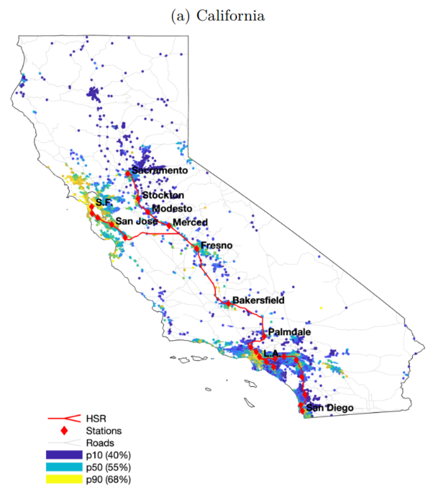
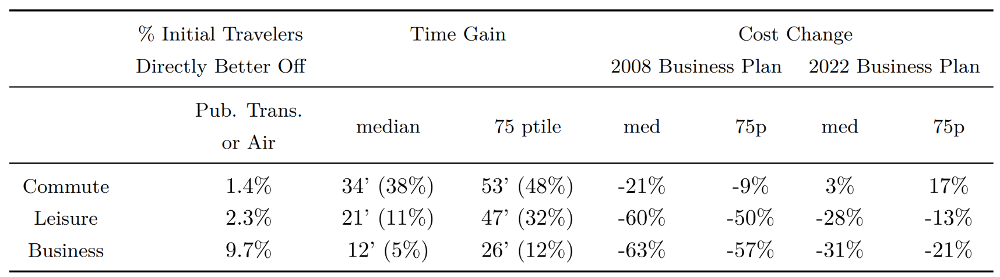
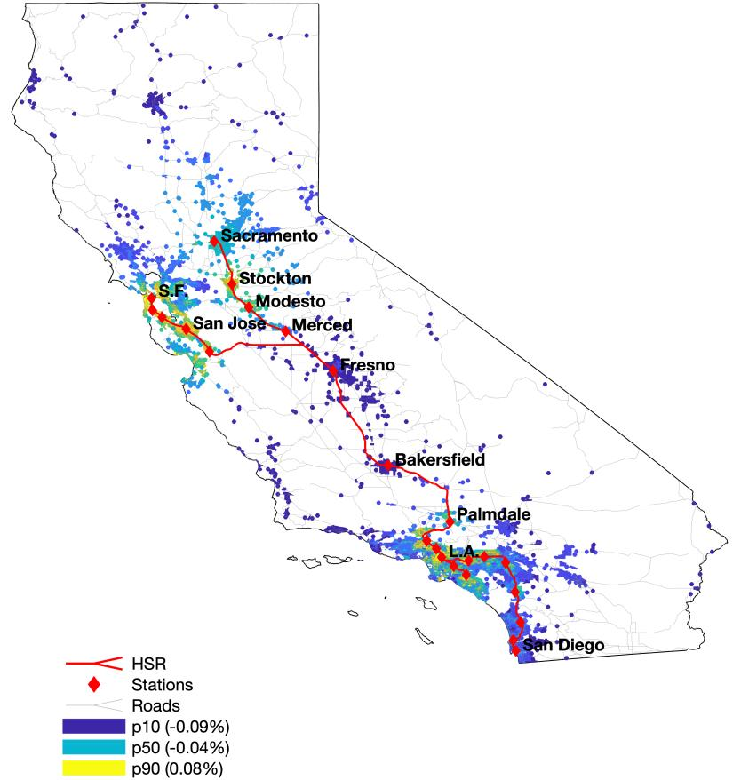
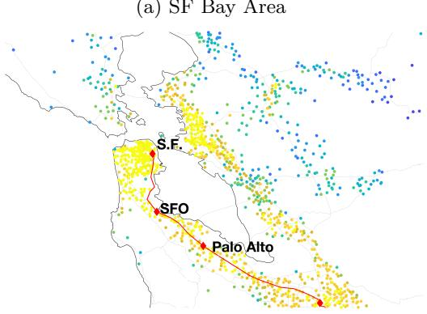
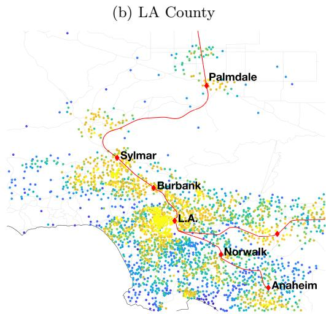
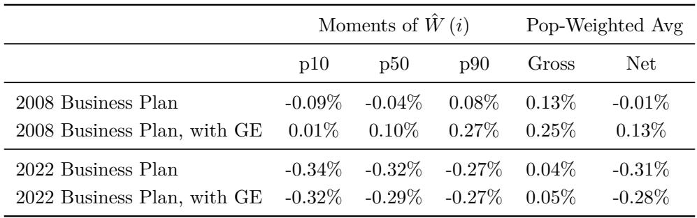
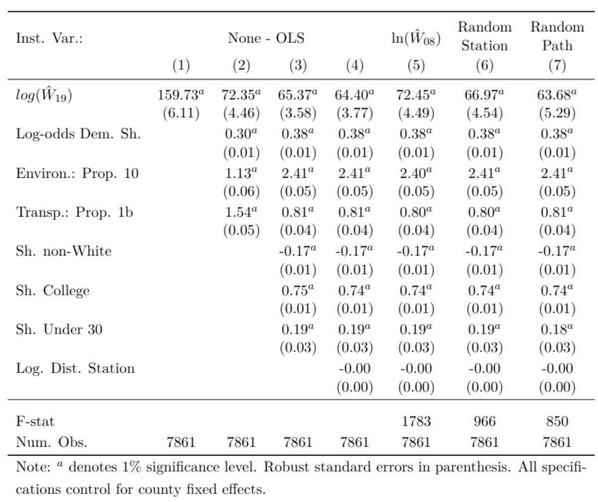
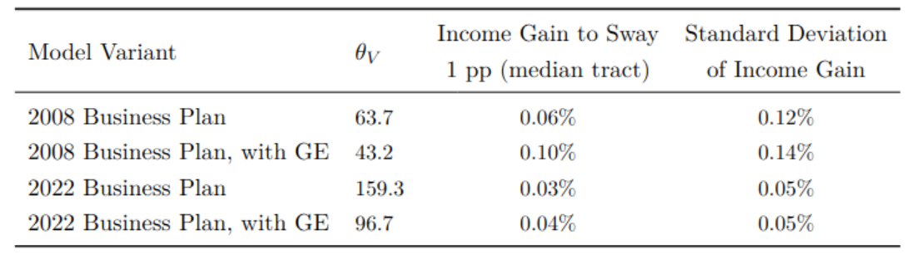
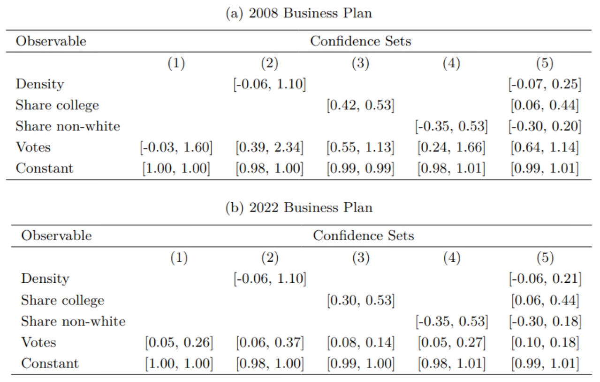
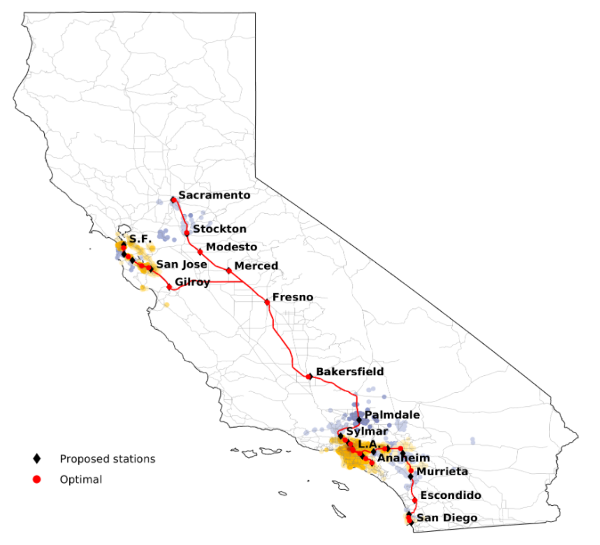

## Motivation

- Growing literature on the optimal transport infrastructure
  - Highway, bus, taxi, port, etc.
- But real-world implementations are often (far) away from optimal
  - Political incentives / constraints
  - Social planner optimizes economic welfare **+ political support & feasibility**
  - The latter *distorts* economic efficiency in exchange for political gains
- This paper:
  - Route and stations placement of California High-Speed Rail (CHSR)
  - Planner's objective: Economic welfare + votes in favor of CHSR bond in 2008
  - Estimate planner's political weight from the data
  - Apolitical counterfactual: what if the planner ignores votes?

---

## Roadmap

1. Build a quantitative spatial model to predict real wage gains of CHSR
   - 3 types of transit demand: commuting, leisure, and business travel
   - Planner's belief = model-predicted real wage gains
2. Estimate the voting response to the projected real wage gains
   - Planner's belief = estimated voting elasticity × model-predicted real wage gains
3. Planner's problem: max expected economic welfare + expected votes in favor
4. Estimate the planner's Pareto and political weights from the data
5. Counterfactual: Route and station placement without political considerations

---

## The California High-Speed Rail project

:::: {.columns}

::: {.column width="60%"}
- SF ↔ LA + branches to Sacramento and San Diego
  - 2 hrs 40 mins
  - 24 stations
- Early planning began in 1996
- Bond measure (Proposition 1A) went on ballot in 2008, 52.6% approved
- Still under construction since 2015
- 3 routes were considered:
  - Coastal route (❌, expensive)
  - via Interstate 5 (❌, remote from populated areas)
  - via Central Valley (✔️)
:::

::: {.column width="40%"}
{#fig-proposition1a}
:::
::::

::: {.notes}
- Favorable votes are concentrated in the Bay Area and LA, as well as Central Valley regions where a station is located near them.
- Q: whether this distribution of station is affected by political incentives?
:::

---

## Model -- Utility and voting

[Notation]{.bh .invert} $i$ residence; &ensp; $j$ workplace; &ensp; $s \in \{Y,N\}$ existence of CHSR

[Utility]{.bh .invert} 
$u_{\omega}(s) = \mathbb{E} \left[ \ln W(i, s) \mid \mathcal{I}_i \right] + \ln a(i, s) + \varepsilon^{u}_{\omega}(s)$

- [$W(i, s)$]{.bh} real wage of residents in $i$ with (or without) CHSR
- [$\mathcal{I}_i$]{.bh} information set for voters in $i$
- [$a(i, s)$]{.bh} exogenous non-monetary preference for CHSR
- [$\varepsilon^{u}_{\omega}(s)$]{.bh} T1EV shock with shape $\theta_V$

[Vote share]{.bh .invert} 
$$
v(i) = \frac{
    e^{\theta_V \left( \mathbb{E} \left[ \ln \hat{W}(i) \mid \mathcal{I}_i \right] + \ln \hat{a}(i) \right)}
}{
    1 + e^{\theta_V \left( \mathbb{E} \left[ \ln \hat{W}(i) \mid \mathcal{I}_i \right] + \ln \hat{a}(i) \right)}
},
\quad \hat{W}(i) \equiv \frac{W(i, Y)}{W(i, N)}
$$

::: {.notes}
Sincere voting, no strategic voting.
:::

---

[Present discounted value of real wage change]{.bh .invert}
$$
\ln \hat{W}(i) = 
\underbrace{(1 - R) \ln (1 - t)}_{\text{upfront tax}}
+ 
\underbrace{R \ln \hat{V}(i)}_{\text{net gain if completed}},
\quad R \equiv (1 + r)^{-T} \frac{p}{r + p}
$$

- [$t$]{.bh} income tax rate to finance CHSR
- [$T$]{.bh} minimum years of construction
- [$1/(1+r)$]{.bh} discount factor
- [$p$]{.bh} probability of completion after $T$ years
- [$\hat{V}(i)$]{.bh} net gain of operational CHSR
  - Importantly, differ by $i$

---

## A quantitative model of high-speed rail

Augmented Berlin-wall model with 3 types of travel: commuting, leisure, and business.

[Worker's problem]{.bh .invert} Indirect utility $v_{\omega}(i, j_C, m_C, j_L, m_L, s) =$
$$
\begin{aligned}
\max_{C, H_C, T_L}
B(i, s)
\frac{C^{1-\mu_L-\mu_H} H_C^{\mu_H}}{d_C(i, j_C, m_C, s)}
\left(
    \frac{q_L(i, j_L) B(j_L, s) T_L}{d_L(i, j_L, m_L, s)}
\right)^{\mu_L}
\varepsilon^{C}_{\omega}
\varepsilon^{L}_{\omega} \\
\text{s.t. } \quad 
C + r(i, s) H_C + p_L(i, j_L, m_L, s) T_L = I(i, j_C, m_C, s)
\end{aligned}
$$

- $C$ consumption, $H_C$ housing (share $\mu_H$), $T_L$ leisure trips (share $\mu_L$)
- $j_C, m_C, j_L, m_L$ commuting (leisure trip) destination and mode
- $B(\cdot)$ amenity, $q_L(i, j_L)$ leisure trip demand shifter
  - **Linking high-$B$ tracts is welfare-enhancing**
- $d_C(\cdot), d_L(\cdot)$ commuting (leisure trip) utility cost
- $\varepsilon^{C}_{\omega}, \varepsilon^{L}_{\omega}$ T2EV shocks with shapes $\theta_C, \theta_L$

---

[Commuting costs]{.bh .invert} $d_{k}(i, j, m, s) = D_{k}(i, m) \tau_{k}(i, j, m, s)^{\rho} \quad \text{for } k = C, L, B$

- $D_{k}(i, m)$ taste shifter (e.g. urbanite prefers public transit)
- $\tau_{k}(i, j, m, s)$ travel time

[Disposable income]{.bh .invert} $I(i, j_C, m_C, s) \equiv (1 - t(s)) y(i, j_C, s) - p_C(i, j_C, m_C, s) T_C$

- $t(s)$ income tax rate to finance CHSR
- $p_C(i, j_C, m_C, s)$ commuting monetary cost
- $T_C$ working days per year

[Gross income]{.bh .invert} $y(i, j_C, s) \equiv e(i) w(j_C, s) + \eta(i) r(i, s).$

- $e(i)$ efficiency units of labor
- $\eta(i)$ locally owned floor space per resident

---

[Production]{.bh .invert} $Y_{\omega}(j, H_Y, N_Y, T_B, j_B, m_B, s) =$
$$
A(j, s) H_Y^{\mu_H} N_Y^{1-\mu_H-\mu_B}
\left(
  \frac{q_B(j, j_B) A(j_B, s) T_B}{d_B(j, j_B, m_B, s)}
\right)^{\mu_B}
\varepsilon^{B}_{\omega}(j_B, m_B).
$$

- A continuum of firms $\omega$ produce a homogeneous, freely traded good
- Inputs: floor space ($H_Y$), labor ($N_Y$), and business trips ($T_B$)
- $A(j,s)$ productivity, $T_B$ number of firms
- $\varepsilon^{B}_{\omega}$ T2EV shocks with shapes $\theta_B$
- **Linking high-$A$ tracts is productivity-enhancing**

---

[Productivity & amenity spillovers]{.bh .invert}

$$
A(j, s) = Z_A(j) \Bigg( \sum_{k \in \mathcal{J}} e^{-\rho_A^{\text{spillover}} \tau^{\min}(j, k, s)} \underbrace{\frac{\tilde{N}_Y(k, s)}{H(k)}}_{\text{employment density}} \Bigg)^{\gamma_A^{\text{spillover}}}
$$
$$
B(i, s) = Z_B(i) \Bigg( \sum_{k \in \mathcal{J}} e^{-\rho_B^{\text{spillover}} \tau^{\min}(j, k, s)} \underbrace{\frac{\tilde{N}_Y(k, s)}{H(k)}}_{\text{employment density}} \Bigg)^{\gamma_B^{\text{spillover}}}
$$

Compare to Berlin-wall paper: Residence is fixed, so both spillovers depend on employment.

Taken from the Berlin-wall paper: $\gamma_A = 0.071, \gamma_B = 0.155, \rho_A=0.361, \rho_B=0.759$.

---

[Equilibrium welfare]{.bh .invert}
$$
V(i, s) \propto \frac{B(i, s)}{r(i, s)^{\mu_H}} \Omega_C(i, s) \Omega_L(i, s),
$$

[Commuting access]{.bh} $\Omega_C(i, s) \equiv 
\left(
    \sum_{j \in \mathcal{J}} \sum_{m \in \mathcal{M}_C}
    \left(
        \frac{I(i, j, m, s)}{d_C(i, j, m, s)}
    \right)^{\theta_C}
\right)^{\frac{1}{\theta_C}}
$

[Leisure access]{.bh} $\Omega_L(i, s) \equiv 
\left(
    \sum_{j \in \mathcal{J}} \sum_{m \in \mathcal{M}_C}
    \left(
        \frac{q_L(i, j) B(j, s)}{p_L(i, j, m, s) d_L(i, j, m, s)}
    \right)^{\mu_L \theta_L}
\right)^{\frac{1}{\theta_L}}
$

[Equilibrium productivity]{.bh .invert} TFP of firm in $j$ is
$$
\Omega_B(j, s) \equiv \kappa_B A(j, s)
\left(
    \sum_{j_B \in \mathcal{J}} \sum_{m \in \mathcal{M}_B}
    \left(
        \frac{q_B(j, j_B) A(j_B, s)}{p_B(j, j_B, m_B, s) d_B(j, j_B, m_B, s)}
    \right)^{\theta_B \mu_B}
\right)^{\frac{1}{\theta_B}}
$$

---

## CHSR shock hat-algebra

[Welfare gains]{.bh .invert}
$\hat{V}(i) = \left( \frac{\hat{B}(i)}{\hat{r}(i)^{\mu_H}} \right) \hat{\Omega}_C(i) \hat{\Omega}_L(i)$

[Commuting]{.bh .invert}
$\hat{\Omega}_C(i) \equiv \left( \sum_{j \in \mathcal{J}} \sum_{m \in \mathcal{M}_C} \lambda_C(i, j, m) \left( \frac{\hat{I}(i, j, m)}{\hat{\tau}(i, j, m)^{\rho}} \right)^{\theta_C} \right)^{\frac{1}{\theta_C}}$

[Leisure]{.bh .invert}
$\hat{\Omega}_L(i) \equiv \left( \sum_{j \in \mathcal{J}} \sum_{m \in \mathcal{M}_L} \lambda_L(i, j, m) \left( \frac{\hat{B}(j)}{\hat{p}_L(i, j, m) \hat{\tau}(i, j, m)^{\rho}} \right)^{\mu_L \theta_L} \right)^{\frac{1}{\theta_L}}$

[Productivity]{.bh .invert}
$\hat{\Omega}_B(i) = \hat{A}(i) \left( \sum_{j \in \mathcal{J}} \sum_{m \in \mathcal{M}_B} \lambda_B(i, j, m) \left( \frac{\hat{A}(j)}{\hat{p}_B(i, j, m) \hat{\tau}(i, j, m)^{\rho}} \right)^{\mu_B \theta_B} \right)^{\frac{1}{\theta_B}}$

$\lambda$'s are pre-CHSR origin-destination-mode shares.

---

## Data

7,866 census tracts in California.

- 2006-2010 ACS: commuting flow [$\lambda_C(i,j,m)$]{.dim}
- 2010-2012 California Household Travel Survey: leisure [$\lambda_L$]{.dim} and business trips [$\lambda_B$]{.dim}
- Travel time [$\tau(i,j,m,s)$]{.dim}
  - Google Maps (car and bus), official schedules (train and air)
  - CHSR business plan (in 2008 and 2022)
- Monetary travel cost [$p_C(i,j,m,s), p_L(i,j,m,s), p_B(i,j,m,s)$]{.dim}
  - Estimate per-mile cost for cars
  - Official fares for bus, train, air
  - CHSR business plan (in 2008 and 2022)
- Location fundamentals (wages, population, demographics) in 2008 and 2019

---

## Estimating $\theta_C, \theta_L, \theta_B, \rho$

[Commuting gravity]{.bh .invert} Data: $\lambda_C, I, \tau$.
$$
\lambda_C(i, j, m) = 
\frac{
    \left( \frac{I(i, j, m)}{D_C(i, m)} \right)^{\theta_C} \tau(i, j, m)^{-\theta_C \rho}
}{
    \sum_{j' \in \mathcal{J}} \sum_{m' \in \mathcal{M}_C}
    \left( \frac{I(i, j', m')}{D_C(i, m')} \right)^{\theta_C} \tau(i, j', m')^{-\theta_C \rho}
}
$$

- Commuting modes $\mathcal{M}_C =$ {car, public transit, walk/bike}
- **log transformation and inversion of $D_C$ won't work**
  - Sparsity of $\lambda_C$ (zero flows due to finite sample size)
  - Solution: Assume $D_C = \mathbf{X}_C(i)' \boldsymbol{\Psi}_C(m)$, then run GMM to recover $\{\theta_C, \rho, \boldsymbol{\Psi}_C(m)\}$
    - Share of car owners, under 30, college graduates, nonwhite; median income; pop density
    - Internal consistency?
- When computing CHSR welfare gains $\hat{V}(i)$, use model-implied $\lambda_C$

---

[Business and leisure travel gravity]{.bh .invert} $(k = B, L)$ Data: $\lambda_k, \tau, p_k$.
$$
\lambda_k(i, j, m) = 
\frac{
    \left( \frac{Z_k(i, j)}{D_k(i, m)} \right)^{\mu_k \theta_k}
    \tau(i, j, m)^{-\rho \mu_k \theta_k}
    p_k(i, j, m)^{-\mu_k \theta_k - 1}
}{
    \sum_{j \in \mathcal{J}} \sum_{m \in \mathcal{M}_k}
    \left( \frac{Z_k(i, j)}{D_k(i, m)} \right)^{\mu_k \theta_k}
    \tau(i, j, m)^{\rho \mu_k \theta_k}
    p_k(i, j, m)^{-\mu_k \theta_k - 1}
}
$$

- Modes $\mathcal{M}_B = \mathcal{M}_L =$ {car, public transit, airplane}
- Externally calibrate $\mu_L=0.05, \mu_B=0.015$.
- Assume $Z_k(i,j) = f(\mathbf{X}_k(i), \mathbf{X}_k(j))$

[GMM estimates]{.bh .invert}
$(\hat{\rho}, \hat{\theta}_C, \hat{\theta}_L, \hat{\theta}_B) = (0.21, 3.35, 43.8, 185.6)$

---

## Projected CHSR real income gains (without GE)

- Assume CHSR is a perfect substitute for public transit (commuting) and air travel (business/leisure)
  - CHSR shares the demand shifter of public transit and air travel. *Strong assumption?*
  - Induce changes in $\tau(i,j,m)$ and $p_k(i,j,m)$ iff CHSR is better in utility term

---

::: {layout-ncol=2 #fig-spatial-welfare-gains}

::: {#layout-nrow=2}

:::

Spatial Distribution of Real-Income Gains ($\hat{W}(i)$) from the CHSR (without GE)
:::

---

## Projected CHSR real income gains (+GE)

- GE amplifies real income gains
- 2022 plan projects way higher ticket prices and capital costs
  - Thus, a net loss in real income on average, even with GE

---

## Estimating votes elasticity

[Voters' belief on gains]{.bh .invert} Assumed to be model-predicted gains + two errors
$$
\mathbb{E} \left[ \ln \hat{W}(i) \mid \mathcal{I}_i \right] = \ln \hat{W}_{19}(i) - \epsilon_{W,1}(i) - \epsilon_{W,2}(i).
$$

- $\ln \hat{W}_{19}(i)$: model-predicted real income gains evaluated with 2019 fundamentals
- $\epsilon_{W,1}(i)$: voters' expectation error (voter's error)
  - Rational expectation implies zero-mean → classical measurement error
  - Instrument $\ln \hat{W}_{19}(i)$ with $\ln \hat{W}_{08}(i)$ to difference out this term
- $\epsilon_{W,2}(i)$: model misspecification error (econometrician's error)
  - Can only be addressed by robustness checks
    - with vs without GE, 2008 vs 2022 business plan

---

[Estimating equation]{.bh .invert} For favorable vote share $v(i)$ in tract $i$:
$$
\ln \left( \frac{v(i)}{1 - v(i)} \right) = \theta_V \ln \hat{W}_{19}(i)
+ \underbrace{\mathbf{X}(i)' \boldsymbol{\beta}}_{\theta_V \ln \hat{a}(i)}
+ \epsilon(i)
$$

- Instrument $\ln \hat{W}_{08}(i)$ addressed the measurement error, but may correlate with $\epsilon(i)$ 
  - **Randomization IV**: $\ln \hat{W}^{IV}_{08}(i) = \frac{1}{100} \sum_{n=1}^{100} \ln \hat{W}^{cf}_{08}(i, n)$
  - Randomize stations placement 100 times, get 100 counterfactual welfare gains $\hat{W}^{cf}_{08}$
  - Intuition: If a location consistently receives positive shock, $\ln \hat{W}^{IV}_{08}(i) > 0$, then we say it's less likely due to non-random selection of CHSR route

---

## Voting response estimates

---

- Implied elasticity of economic voting is huge
  - Only 0.06% gains in real income → 1 ppt increase in favorable votes
- Estimates with GE are smaller
  - Given the same $\operatorname{Var}(v)$, GE implies a larger $\operatorname{Var}(\hat{W})$, hence a smaller $\theta_V$

---

## Planner's problem

- Choice space: $\mathbf{d} = \{d_i \mid d_i \in \mathscr{D}, i=1, \ldots, 24\}$
  - $\mathscr{D}$: set of **feasible** locations (i.e. any point on the route)

[Planner's objective]{.bh .invert} Choose $\mathbf{d}$ to maximize the expected value of
$$
\mathcal{W}(\mathbf{d})
\equiv \sum_{i=1}^{I} \lambda_U(i) N_R(i)
\underbrace{\mathbb{E}_{\omega} \left[\ln \hat{W}(i; \mathbf{d})\right]}_{\text{real income gain}}
+ \lambda_V \sum_{i=1}^{I} \underbrace{N_R(i) v(i; \mathbf{d})}_{\text{# favorable votes}}.
$$

- $\lambda_U(i) \equiv \mathbf{Z}(i)' \mathbf{b}$: Pareto weight of resident in $i$ (Utilitarian iff $\lambda_U(i) = 1$)
- $\lambda_V$: Political weight of favorable votes
- Internal consistency: Why is non-monetary preference $\hat{a}(i)$ not in planner's objective?
- Goal: Estimate $\lambda_U(i)$ and $\lambda_V$ assuming the current alternative is optimal
  - i.e. $\mathbf{d}^{0} = \arg \max_{\mathbf{d}} \mathcal{W}(\mathbf{d})$

---

## Bounding the planner's weights: Moment inequality approach

[Optimality condition]{.bh .invert} implies that for any deviation $\mathbf{d}^{n}$:
$$
\begin{aligned}
&\mathbb{E} \left[ \mathcal{W}(\mathbf{d}^n) - \mathcal{W}(\mathbf{d}^0) \right] \\
&\approx \sum_{i=1}^{J} \Bigg( \lambda_U(i) + \lambda_V \underbrace{\frac{\partial v(i)}{\partial \ln \hat{W}(i)}}_{\text{vote swaying}} \Bigg) N_R(i) \underbrace{\Delta \ln \hat{W}(i, \mathbf{d}^n)}_{\Delta \text{ real income gain}} - \underbrace{\epsilon(\mathbf{d}^n)}_{\text{expectation error}} \leq 0
\end{aligned}
$$

[Identification argument]{.bh .invert}

- Consider a deviation that yields ↑↑↑ votes, but ↓ real income
- That deviation wasn't chosen → $\lambda_V$ can't be too large, and $\lambda_U$ can't be too small
- Otherwise, the planner would have chosen that deviation

---

## Estimates of planner's weights

- Place larger weight on tracts with more college-educated residents
- Indifferent between 1 ppt increase in favorable votes and 0.14%~0.89% additional real income gain

---

## Apolitical planner ($\lambda_V = 0$)

::: {.columns}

::: {.column width="55%"}

- Stations moved closer to population centers
  - where votes are harder to sway due to their high level of support (logit assumption)
  - tracts with top-quartile density have real income gain ↑ 0.05 ppts
  - population-weighted average real income gain ↑ 0.02 ppts
    - average gross gain was 0.13%
- Aggregate vote share declined 0.02 ppts
  - Still a majority in favor (52.60% → 52.58%)
- Utilitarian counterfactual looks similar
- Capital costs were held fixed
- Why does it have to be 24 stations?

:::

::: {.column width="45%"}

:::

:::

---

## Would apolitical planner choose I-5 route?

- One common explanation: I-5 route was killed due to its political infeasibility
  - Central Valley residents couldn't access it, hence wouldn't support it
  - Is this a tenable explanation?
- Unknown capital costs of I-5 route
  - Estimate its lower bound: I-5 route must cost at least X% of Central Valley route not to be chosen
  - Estimated X = 88 (using 2008 forecasts)
- Given this estimated lower bound, consider an apolitical planner's optimal plan under I-5 route
- The current plan still dominates the apolitical optimal I-5 plan
- Conclusion: I-5 was unlikely rejected due to vote-swaying considerations

---

## Thoughts

- A first step towards the political economy in the quantitative transit literature
- Highly reduced-form representation of political incentives
- Alternative mechanisms
  - Role of state legislators & legislative bargaining, party politics
  - Lobbying
  - Local NIMBYism (enters via planning costs)
- Restrictive choice set of the planner
- New goods problem in the demand estimation
  - CHSR assumed to be a perfect substitute for public transit & air travel
  - Perhaps extrapolate from the demand of Northeast Corridor (BOS-NYC-WAS)?
- A statistical test of whether politicians and voters know GE

---

## Takeaways

- Political incentives push the CHSR stations to less populated areas
  - Increased political support at the price of economic efficiency
- Planner is far from utilitarian
- Political constraints matter