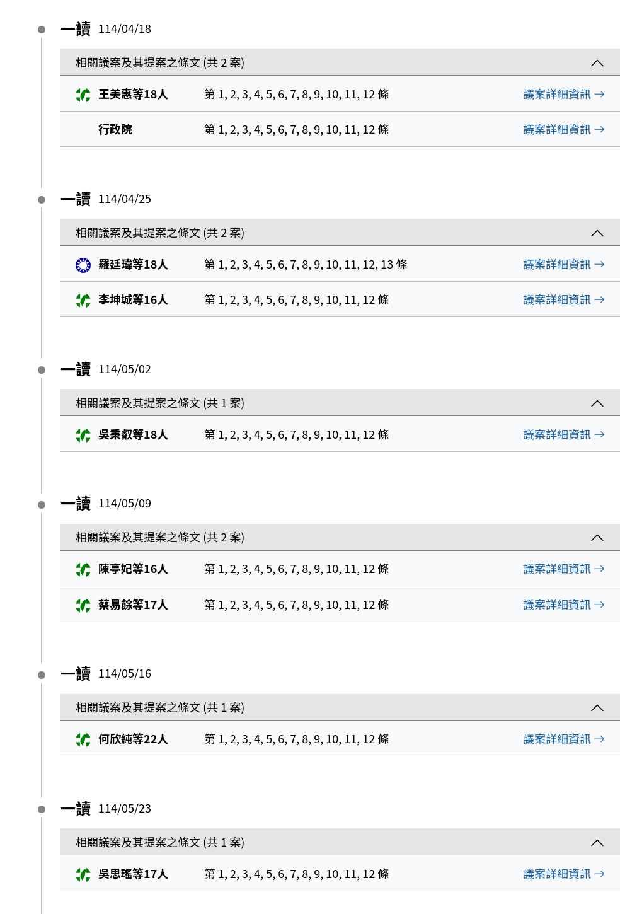

# 戶政資料外洩

---

:::: {.columns}
::: {.column width="40%"}

:::

::: {.column width="60%"}
- 2022 年底，全台 2357 多萬筆戶政資料在駭客論壇遭兜售。資料截斷點：2018 年 4 月。
- 洩漏內容：
  - 姓名、**身分證字號**、生日、性別
  - 父母與配偶等親屬關係
  - 戶籍地址、兵役紀錄
- 個資法 §12：查明後以**適當方式**通知當事人
  - 內政部：不是我的錯，戶役政系統內外網實體隔離，資料並未流出
  - 直到現在，內政部立場依舊如此

:::
::::

## 我們可以做什麼？

1. 請求國家賠償：[個人資料保護法 §28]{.dim}
   - $500 — $20,000（不易或不能證明其實際損害額）
2. 請求變更身份證字號：
   
   > **國民身分證及戶口名簿格式內容製發相片影像檔建置管理辦法 §5**
   > 
   > 戶政事務所依序配賦統一編號或戶號，有錯誤、重複或**特殊情事**者，由戶籍地或最後戶籍地戶政事務所更正或變更之。
   - 特殊情事：末碼4（5514）、諧音不雅（2945）、數字第3碼至第8碼含3個4以上（1382）、性別變更（233）、與他人重複（87）、**特殊原因**（神明表示統號不好、車禍對造車牌號碼與統號相同）
   - 那「戶政資料外洩」呢？

## 為什麼要更換身分證字號？

- 身分證字號是許多公私機關串接資料的「Primary Key」
  - 各處外洩的資料可以透過身份證字號串起來，身份盜用風險倍增
- 姓名可改、許多證件的號碼可改，但身分證字號**一人一號，終身不變**
  - 若不替換，外洩的舊料加上未來的新料，依然能被輕易勾稽
- 更換終身專屬的身分證字號，是根本性防堵身分盜用風險的手段

## A Tale of Two Citizens

:::: {.columns}
::: {.column width="40%"}

:::

::: {.column width="60%"}
- 向戶所申請變更身分證字號
  - 桃園市民彭先生：獲同意
  - 台北市民何先生：**不同意**
- 拒絕理由：僅憑媒體報導，沒有證明實質損害、需提出「院檢裁判書類」才能辦理
- 申請遭拒，進入訴願及行政訴訟階段

:::
::::

## 行政訴訟爭點

1. **真的有外洩嗎？**
2. 個資外洩但「未有實際遭偽冒用之具體損害」，是否構成《身分證管理辦法》第5條之「特殊情事」？
3. 內政部要求提出「院檢裁判書類」始得辦理，是否合法？
4. 彭先生可以何先生不行、**諧音不雅**可以**資料外洩**不行，是否違反平等原則？

## 歷史性的勝訴

法院判決：原處分撤銷，准予變更身分證字號。

1. 法庭勘驗證據確實遭外洩
2. 法院認定本案具備「特殊情事」
3. **外洩本身就是對個人資料安全與隱私權的侵害**，不應要求人民額外提出「院檢裁判書類」才能辦理

## 判決對於隱私權的意義：損害的認定

判決肯認「外洩本身即是損害」

- 要求人民舉證因個資外洩而導致「實質損失」（如被盜刷、詐騙幾萬元）
- 本案突破：
  - 隱私權受侵害，以及隨之而來的恐懼與風險，本身就是損害
  - 不應該要求人民額外舉證實質（如金錢）損失才能主張權利

## 餘波：內政部的態度

- **內政部不上訴**：本以為政府會上訴到底，但最終內政部未提上訴，全案確定。
- **消極處理**：
  - 面對全台外洩受害者，政府仍無通案處理原則
- **限縮個案範圍**：
  - 內政部定調判決為「個案」，其他民眾想改仍然必須提出「個資外洩遭損害之具體事證」
  - 其他民眾若想更改，可能需經歷同樣的訴訟過程

## 下一步？

訴求：

1. 內政部承認個資外洩
2. 按個資法 §12、§28 規定，主動通知受害者、提供適當的賠償與補救措施
3. 允許有意願換號的民眾更換身份證字號

## {background-image="./images/國賠訴訟.png" background-opacity="0.5" background-size="cover" .center}

<h2 style="text-align: center; background-color: rgba(255, 255, 255, 0.95); padding: 1em; border-radius: 10px;">
國賠集體訴訟意向調查  
[TBD]()
</h2>

## 薛西佛斯

- 我們應該四處留下終身不可變的唯一識別碼嗎？
- 換號後，我已經在醫院、診所、駕訓班、銀行、電信業者......留下了我的新證號
- 為何要讓病例號、駕照號碼、金融帳號、門號都串上一個身份證字號？
- 我們真的需要身份證字號嗎？

## 四叉貓都換了，你還在等什麼？

{fig-align="center" width="75%"}

## {background-image="./images/換號申請書產生器.png" background-opacity="0.5" background-size="cover" .center}

<h2 style="text-align: center; background-color: rgba(255, 255, 255, 0.95); padding: 1em; border-radius: 10px;">
換號申請書產生器  
[TBD]()
</h2>

## 沒有人們

# 行政院個資會

---

## 健保資料庫案後 {.center}

> **111 年憲判字第 13 號** (2022/08/12)
> 
> 由個人資料保護法或其他相關法律規定整體觀察，**欠缺個人資料保護之獨立監督機制**，對個人資訊隱私權之保障不足，而有違憲之虞，相關機關應自**本判決宣示之日起 3 年內，制定或修正相關法律**，建立相關法制，以完足憲法第22條對人民資訊隱私權之保障。

2025 年 8 月應該完成立法，現在...

---

:::: {.columns}
::: {.column width="45%"}

:::

::: {.column width="45%"}
](./images/個資會timeline-2.png)
:::
::::

## 卡在哪？

黨團協商後，無共識、保留送院會處理之條文

| 行政院版                                                     | 爭議       |
| ------------------------------------------------------------ | ---------- |
| **第三條** 本會置委員**五人至七人**，其中一人為主任委員，職務比照簡任第十四職等，對外代表本會；一人為副主任委員，職務比照簡任第十三職等；其餘專任委員二人，職務比照簡任第十二職等；兼任委員一人至三人。 | 委員人太少 |
| **第十條** 本會為因應數位科技快速發展，提升對個人資料之保護，得依聘用人員聘用條例之規定，聘用個人資料保護、數位科技與應用、資通安全、稽核、人權、經濟、管理、產業政策、國際合作等相關領域專業人員，其聘用員額不得超過**五十人**。 | 約聘人太多 |

## Q&A {.center}