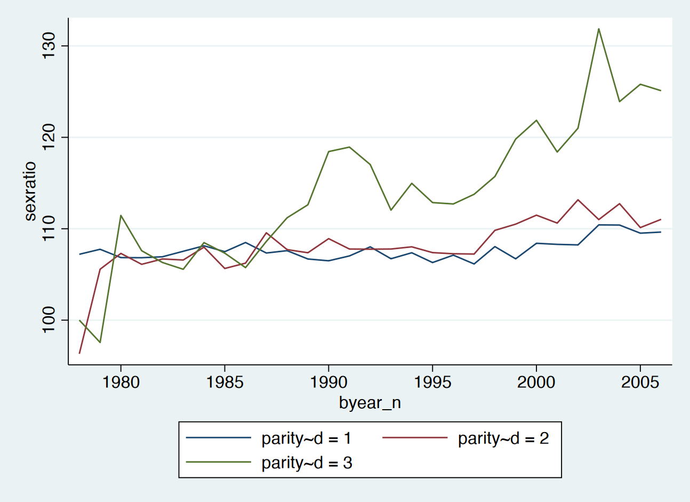
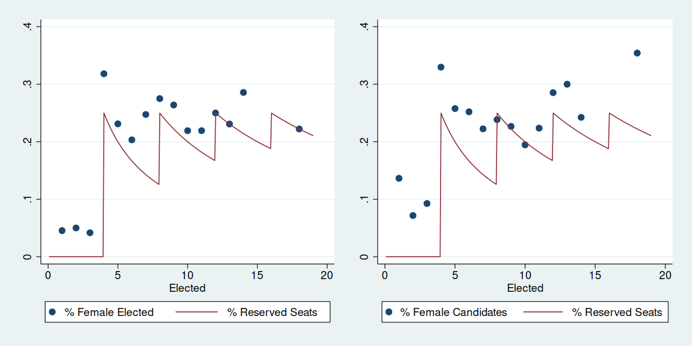

## Highlights

1. We utilized women reserved seats in council elections to estimate casual effects of gender quotas on female status.
2. Increased gender quotas leads to lower son preference, which is supported by newborns data and survey.
3. No significant effect on gender role attitudes.

# Background

## A Progressive Gender Perspective of *ROC Consitution*

> *中華民國憲法第 134 條*
>
> 各種選舉，應規定婦女當選名額，其辦法以法律定之。

- Mandatory women reserved seats in *any* election codified in *ROC Constitution* since 1946
- Local council elections in Taiwan reserved 1 woman seat per 4 elected member (or per 5 before 1999)
  - Guaranteeing 14% ~ 25% female representatives for electoral districts having $\geq$ 4 members
- The lowest voted male winner will be replaced by highest voted female candidate if the requirement doesn’t meet.

---

Past researches on effects of women political representation utilized a natural experiment in India

### 1993 Constitution Amendment in India

- 1/3 seats reserved for women in local council elections
- Higher female political representation due to this policy
- **Identification**: States adopting this policy was designated randomly, causing random treatment and time variation

# Data and Identification Strategy

### Outcomes: Son Preference

1. Having 3rd child
2. Sex ratio of 3rd parity

From MOI Newborns Data between 1998 and 2006

- Samples: Couples who already have 2 children, deciding whether to have 3rd one.
- Transformed into balanced panel data by couple and year 

---

{width=80%}

---

### Survey Outcomes: Son Preference & Gender Role

Taiwan Social Change Survey

- Sample: Period 2001, 2006
  1. 「為傳宗接代，至少要生一兒子」
  2. 「一個家庭幾個小孩最理想」
- Sample: Period 2011, 2016
  - Gender role variables

---

Vote data from 1998, 2002, 2005 council elections.

### Instrument: % of reserved seats

- $Z_{ed} = \frac{\text{Reserved Seats 保留名額數}}{\text{Member Size 應選人數}}$, in election year $e$, electoral district $d$
- Determined by population size of electoral district.

### Potential Treatments

- % female elected
- % female candidates

Both could affect outcomes. Exclusion restriction not satistied. Thus I’ll present 1st stage and reduced form.

---

## 1st Stage Estimations

\

Control for population size to prevent OVB.

---

### 1st Stage Estimations

$$
X_{td} = \alpha + \beta_1 \text{\% Reserved Seats}_{td}  + \gamma_1 \ln \operatorname{pop}_{tc} + \delta_t + \delta_{c}
$$

in election year $t$, district $d$, county $c$

---

\include{tables/1ststage.tex}

# Results

Reduced form specification:
$$
Y_{itcd} = \alpha + \rho_1 \text{\% Reserved Seats}_{td}  + \gamma_1 \ln \operatorname{pop}_{tc} + X_i' \eta + \delta_t + \delta_{c}
$$

for couple $i$, year $t$, county $c$, electoral district $d$

## Birth Outcome: Having 3rd Child

\include{tables/birth_child3_rf_panel.tex}

## Birth Outcome: 3rd Parity Sex Ratio

\include{tables/birth_sex3_rf_panel.tex}

## Survey Outcome: Son Preference

From TSCS 2001, 2006. 

\include{tables/TSCS_rf_son.tex}

## Survey Outcome: Gender Role

From TSCS 2011, 2016; 1 = Pro-female

\include{tables/TSCS_rf_role.tex}

# Remarks

- Weaken son preference: Higher satisfaction of current status for couples without son.
- Women with lower educational attainment was more susceptible to exposure
- Survey confirmed decreasing son preference.
- No significant effect on gender role attitudes. 

## Possible Mechanisms

1. Role model effects:

   Interaction between female council member and female voters.

2. Policy effects:

   Public good provision, pro-female & childcare policies.
