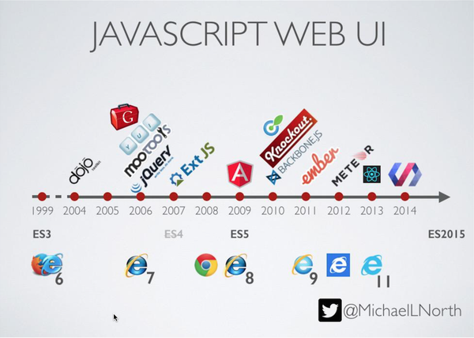
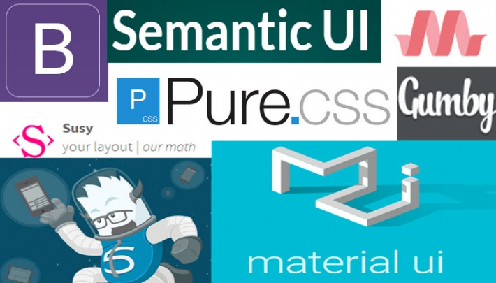
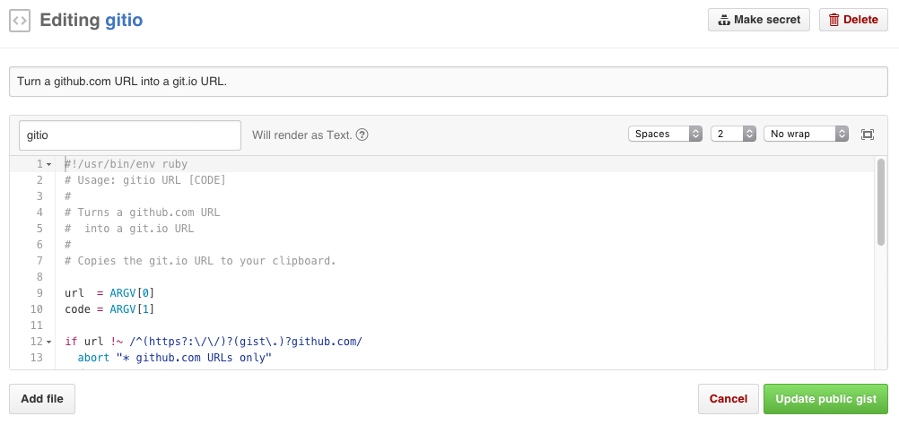
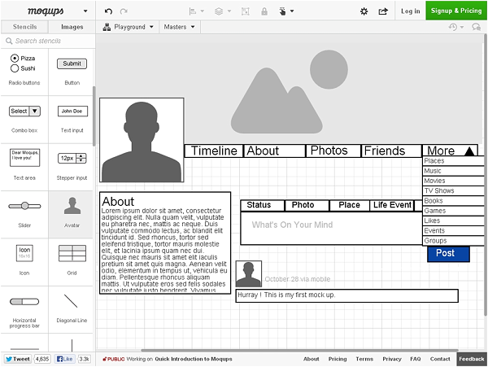
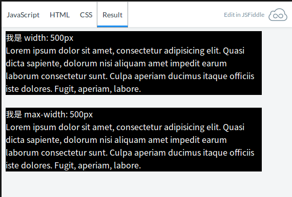
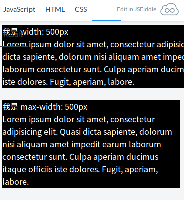

# SITCON Summer Camp
# 前端分流課程 #1
<br>
2016-08-03 By BobbyHo


---

# Who Am I ?
* 何雨忻 BobbyHo
* 106 會考生 QAQ
* 魯宅國中生
* ReactJS 廚
* http://about.bobbyrealms.info
* angela.bobby@gmail.com


---

# 風起雲湧的前端世界

^^^

## 純 HTML 時代
寫出來的網頁什麼樣式都沒有，相當簡陋

^^^

## CSS & JS
* CSS 的概念在 1994 年被提出
* JavaScript 在 1995 年面世


^^^

## HTML + CSS + JS   
前端的三巨頭到齊，可以召喚神龍了(X


^^^

## 收個信還要一直 F5 很煩欸 (#`Д´)ﾉ

^^^

## AJAX is here!
#### 應用情境
* Gmail
* 送出表單
* ~~全自動掛機打掉別人的網站~~


^^^

## JavaScript UI 框架


^^^

## CSS 框架


^^^

## 學前端真的很可憐
◢▆▅▄▃崩╰(〒皿〒)╯潰▃▄▅▇◣

---

# 開發者的四次元口袋


^^^

## JSFiddle
https://jsfiddle.net/
* 前端遊樂場
* 內建各種 JS Library
* 匯入外部資源
* 公開協作

^^^

## Gist (By GitHub)
https://gist.github.com/

片段程式碼共享、支援版本控制

^^^

## moqups
https://moqups.com/
   
建構網站雛形、記錄佈局靈感

---

# 進階 CSS

---

## CSS 選擇器

^^^

```
.class
#id
*   //所有元素
div   //所有 div 元素
div, p   //所有 div 及所有 p 元素
div > p   //直屬 div 的 p 元素（ p 為 div 的直屬子元素）
div p   //所有在 div 底下的 p 元素（不論是否直屬 div）
div + p   //所有與 div 相鄰 p 元素
div ~ p   //所有在 div 後，與 div 同級的 p 元素
```


^^^


## Example 1
選擇器： `.intro, p`

```
<div class="intro"> <!-- 選到了 -->
	<h1>I'm h1</h1>
	<div>
		<p>I'm p element</p> <!-- 選到了 -->
	</div>
	<p>I'm p element 2</p> <!-- 選到了 -->
</div>
<p>I'm p element 3</p> <!-- 選到了 -->

```


^^^


## Example 2
選擇器： `.intro > p`

```
<div class="intro"> <!-- 我"沒"被選到QAQ -->
	<h1>I'm h1</h1>
	<div>
		<p>I'm p element</p> <!-- 我"沒"被選到QAQ -->
	</div>
	<p>I'm p element 2</p> <!-- 選到了 -->
</div>
<p>I'm p element 3</p> <!-- 我"沒"被選到QAQ -->

```


^^^


## Example 3
選擇器： `.intro p`

```
<div class="intro"> <!-- 我"沒"被選到QAQ -->
	<h1>I'm h1</h1>
	<div>
		<p>I'm p element</p> <!-- 選到了 -->
	</div>
	<p>I'm p element 2</p> <!-- 選到了 -->
</div>
<p>I'm p element 3</p> <!-- 我"沒"被選到QAQ -->

```


^^^


## Example 4
選擇器： `.intro + p`

```
<div class="intro"> <!-- 我"沒"被選到QAQ -->
	<h1>I'm h1</h1>
	<div>
		<p>I'm p element</p> <!-- 我"沒"被選到QAQ -->
	</div>
	<p>I'm p element 2</p> <!-- 我"沒"被選到QAQ -->
</div>
<p>I'm p element 3</p> <!-- 選到了 -->
<p>I'm p element 4</p> <!-- 我"沒"被選到QAQ -->

```

^^^

## Example 5
選擇器： `.intro ~ p`

```
<div class="intro"> <!-- 我"沒"被選到QAQ -->
	<h1>I'm h1</h1>
	<div>
		<p>I'm p element</p> <!-- 我"沒"被選到QAQ -->
	</div>
	<p>I'm p element 2</p> <!-- 我"沒"被選到QAQ -->
</div>
<p>I'm p element 3</p> <!-- 選到了 -->
<p>I'm p element 4</p> <!-- 選到了 -->
<p>I'm p element 5</p> <!-- 選到了 -->

```

^^^

## CSS Pseudo Classes
CSS 偽元素 - CSS 世界的奇技淫巧

^^^

```
div p:nth-child(2)  // 1.div 中的第二個子元素 2.必須為 p 元素
div p:nth-of-type(2) //div 中的第二個 p 元素
div p:first-of-type //div 中的第一個 p 元素
div :first-of-type //div 中任何種類元素的第一個

div:hover //滑鼠懸浮在 div 上時
a:link  //a 元素中，沒訪問過的連結
a:active  //a 元素中，按下滑鼠到釋放滑鼠的期間
a:visited  //a 元素中，訪問過的連結

input:focus //當輸入焦點在 input 元素上時
```

^^^

## CSS 優先級
> 規則越具體，優先度越高

^^^

```
<div class="intro">
	<div>
		<p>I'm p element 1</p>
	</div>
	<p>I'm p element 2</p>
</div>
```
```
.intro {
	background-color: white;
	color: black
}

.intro p {
	color: red
}

.intro div > p {
	color: blue
}

```
結果：
<div style="background: white;">
	<div>
		<p style="color: blue;">I'm p element 1</p>
	</div>
	<p style="color: red;">I'm p element 2</p>
</div>

---

## CSS 數值與單位

^^^

### 長度單位
* px (≒ 1/96 inch), pt (≒ 1/72 inch)
* %
* em, rem
	* 1em 為「1倍的母元素字體大小」
	* 1rem 為「1倍的 html 元素字體大小(預設16px)」
* vw, vh
	* 代表螢幕可視範圍的百分比

^^^

### 時間單位
* ms -- 毫秒
* s -- 秒

^^^

### 顏色
* rgb(r, g, b), rgba(r, g, b, alpha)
	* 白色為 rgb(255,255,255)
* Hex (16進位)
	* 白色為 #FFFFFF 也可寫為 #FFF
* Transparent(透明), currentColor (引用 color 屬性的值), 關鍵字（black, yellow, etc.）

實用工具：w3school color picker http://www.w3schools.com/colors/colors_picker.asp

---

## CSS 屬性

---

## 元素尺寸
* width -- 元素寬度
* height -- 元素高度
* max-width/max-height -- 限制元素最高寬/高度
* min-width/min-height -- 限制元素最小寬/高度

^^^

## What's Different 
```
<div class="width-250">
	<p>我是 width: 500px</p> 
	<p>Lorem ipsum dolor sit amet, consectetur adipisicing elit. Quasi dicta sapiente, dolorum nisi aliquam amet impedit earum laborum consectetur sunt. Culpa aperiam 	ducimus itaque officiis iste dolores. Fugit, aperiam, labore.</p>
</div> 
<br>
<div class="max-width-250">
	<p>我是 max-width: 500px</p>
	<p>Lorem ipsum dolor sit amet, consectetur adipisicing elit. Quasi dicta sapiente, dolorum nisi aliquam amet impedit earum laborum consectetur sunt. Culpa aperiam ducimus itaque officiis iste dolores. Fugit, aperiam, labore.</p>
</div> 
```
```
.width-250 {
  width: 500px;
}

.max-width-250 {
  max-width: 500px;
}
```

JSFiddle：https://goo.gl/PGYXKA

^^^

在螢幕尺寸大於 500px 時，兩者沒有不同


^^^

在螢幕尺寸小於 500px 時：   
   
`width: 500px` 堅守寬度為 500px！   
`max-width: 500px` 退縮了，寬度隨著螢幕變化   
（別忘了還有 min-width 可以讓它不要變太小 >_<）